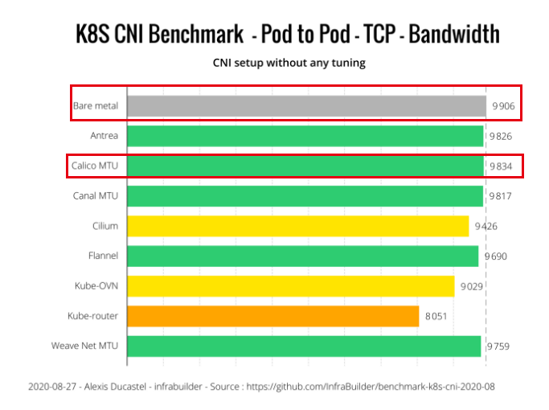
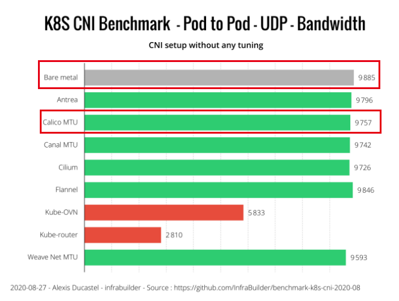

# 当前容器云网络模型及网络开销说明
​	 使用calico纯三层的虚拟网络方案，可以避免与二层方案相关的数据包封装的操作，中间没有任何的NAT，没有任何的overlay；

**网络开销来源：**
- 数据包操作额外开销
- 虚拟网络开销
- pod内部：
- pod到主机：经过veth这个虚拟网络设备
- pod到service：k8s service增加一层L4负载均衡器
- 跨主机：

**一些k8s网络高级特性：**
- 网络带宽限制设置
- 网络策略与流量隔离
- IP池管理
- 负载均衡器


# 容器中的网络延迟与宿主机对比

## 环境准备
- 测试工具： ping(gawk) qperf ab
- 测试机：两台物理机,3个测试pod
```bash
[root@telecom-k8s-phy01 hff]# kubectl get node -o wide
NAME                STATUS   ROLES    AGE   VERSION   INTERNAL-IP   EXTERNAL-IP   OS-IMAGE                KERNEL-VERSION                CONTAINER-RUNTIME
telecom-k8s-phy01   Ready    master   19d   v1.17.2   10.96.0.1     <none>        CentOS Linux 7 (Core)   3.10.0-1160.59.1.el7.x86_64   containerd://1.4.6
telecom-k8s-phy02   Ready    master   19d   v1.17.2   10.96.0.2     <none>        CentOS Linux 7 (Core)   3.10.0-1160.59.1.el7.x86_64   containerd://1.4.6
[root@telecom-k8s-phy01 hff]# kubectl get pod -o wide
NAME                              READY   STATUS    RESTARTS   AGE   IP              NODE                NOMINATED NODE   READINESS GATES
qperf-server-1-5945ff96bd-x2t8t   1/1     Running   0          95s   10.196.192.79   telecom-k8s-phy01   <none>           <none>
qperf-server-2-7f875f65bd-zvh8g   1/1     Running   0          89s   10.196.142.79   telecom-k8s-phy02   <none>           <none>
qperf-server-3-757d688c57-jf5dk   1/1     Running   0          98s   10.196.142.72   telecom-k8s-phy02   <none>           <none>


```


## 测试场景
```
      ┌──────────────────────────────┐              ┌──────────────────────────────┐  
      │                              │              │                              │ 
      │ ┌───────────┐  ┌───────────┐ │              │ ┌───────────┐  ┌───────────┐ │ 
      │ │  PodA-1   │  │  PodA-2   │ │              │ │  PodB-1   │  │  PodB-2   │ │ 
      │ │           │  │           │ │              │ │           │  │           │ │ 
      │ │           │  │           │ │              │ │           │  │           │ │ 
      │ │           │  │           │ │              │ │           │  │           │ │ 
      │ │           │  │           │ │              │ │           │  │           │ │ 
      │ └───────────┘  └───────────┘ │              │ └───────────┘  └───────────┘ │ 
      │                              │              │                              │ 
      │  NodeA                       │              │  NodeB                       │ 
      └──────────────────────────────┘              └──────────────────────────────┘

```
- 测试指标：
1. ping延迟: 用ping测试延迟
```bash
ping <ip> | head -n 20 | gawk '/time/ {split($7, ss, "="); sum+=ss[2]; count+=1;} END{print sum/count "ms";}'
```
2. qperf带宽测试: 用qperf测试带宽和延迟


```bash
# 测试一次带宽和延迟
qperf <ip>  -vu tcp_bw tcp_lat
# 循环测试1bytes-64KiB的带宽和延迟
qperf <ip> -oo msg_size:1:64K:*2 -vu tcp_bw tcp_lat
```
3. HTTP性能测试: 部署单进程nginx server并使用apache benchmark(ab)测试
```
ab -kn 100000 -c 100 http://<ip>
```
>  client>service
>- 跨节点到节点       NodeA>NodeB
>- 本节点到本节点     NodeB>NodeB
>- 同一节点容器到容器 PodB-1>PodB-2
>- 跨节点容器到容器   PodA-1>PodB-2
>- 跨节点节点到容器   NodeA>PodB-1
>- 跨节点容器到节点   PodA-1>NodeB


## 测试数据

|               |     ping     |      qperf                     | b(Requests per second) | 
| ------------- | ------------ | ------------------------------ | ---------------------- |
| NodeA>NodeB   | 0.0643158ms  | bw:1.14 GB/sec <br>lat:109 us  |      8014.82           |
| NodeB>NodeB   | 0.0366316ms  | bw:2.58 GB/sec <br>lat:12.5 us |      23443.23          |
| PodB-1>PodB-2 | 0.08ms       | bw:2.09 GB/sec <br>lat:15.4 us |    53403.66            |
| PodA-1>PodB-2 | 0.196053ms   | bw:1.15 GB/sec <br>lat:24.1 us |      42819.11          |
| NodeA>PodB-2  | 0.0795789ms  | bw:1.17 GB/sec <br>lat:155 us  |     22727.78           |
| PodA-1>NodeB  | 0.110579ms   | bw:1.07 GB/sec <br>lat:19.7 us |     11537.38           |


## 网络监控数据


# 网上找到的一些网络测试报告
https://itnext.io/benchmark-results-of-kubernetes-network-plugins-cni-over-10gbit-s-network-updated-august-2020-6e1b757b9e49?gi=13fb6a0fe8db






https://cloud.tencent.com/developer/news/689058


# 附件
## ping
```bash
# 跨节点到节点       NodeA>NodeB
[root@telecom-k8s-phy01 hff]# ping 10.96.0.2 | head -n 20 | gawk '/time/ {split($7, ss, "="); sum+=ss[2]; count+=1;} END{print sum/count "ms";}'
0.0643158ms
# 本节点到本节点     NodeB>NodeB
[root@telecom-k8s-phy02 hff]# ping 10.96.0.2 | head -n 20 | gawk '/time/ {split($7, ss, "="); sum+=ss[2]; count+=1;} END{print sum/count "ms";}'
0.0366316ms
# 同一节点容器到容器 PodB-1>PodB-2
/ # ping 10.196.142.113 | head -n 20 | gawk '/time/ {split($7, ss, "="); sum+=ss[2]; count+=1;} END{print sum/count "ms";}'
0.08ms
# 跨节点容器到容器   PodA-1>PodB-2
/ # ping 10.196.142.113 | head -n 20 | gawk '/time/ {split($7, ss, "="); sum+=ss[2]; count+=1;} END{print sum/count "ms";}'
0.196053ms
# 跨节点节点到容器   NodeA>PodB-2
/ # ping 10.196.142.113 | head -n 20 | gawk '/time/ {split($7, ss, "="); sum+=ss[2]; count+=1;} END{print sum/count "ms";}'
0.0795789ms
# 跨节点容器到节点   PodA-1>NodeB
/ # ping 10.96.0.2 | head -n 20 | gawk '/time/ {split($7, ss, "="); sum+=ss[2]; count+=1;} END{print sum/count "ms";}'
0.110579ms
```

## qperf
```bash
# 跨节点到节点       NodeA>NodeB
[root@telecom-k8s-phy01 hff]# qperf 10.96.0.2  -vu tcp_bw tcp_lat
tcp_bw:
    bw  =  1.14 GB/sec
tcp_lat:
    latency  =  109 us
# 本节点到本节点     NodeB>NodeB
[root@telecom-k8s-phy02 kbuser]# qperf 10.96.0.2  -vu tcp_bw tcp_lat
tcp_bw:
    bw  =  2.58 GB/sec
tcp_lat:
    latency  =  12.5 us
# 同一节点容器到容器 PodB-1>PodB-2
/ # qperf 10.196.142.113  -vu tcp_bw tcp_lat
tcp_bw:
    bw  =  2.09 GB/sec
tcp_lat:
    latency  =  15.4 us
# 跨节点容器到容器   PodA-1>PodB-2
/ # qperf 10.196.142.113  -vu tcp_bw tcp_lat
tcp_bw:
    bw  =  1.15 GB/sec
tcp_lat:
    latency  =  24.1 us
# 跨节点节点到容器   NodeA>PodB-2
[root@telecom-k8s-phy01 hff]#  qperf 10.196.142.113  -vu tcp_bw tcp_lat
tcp_bw:
    bw  =  1.17 GB/sec
tcp_lat:
    latency  =  155 us
# 跨节点容器到节点   PodA-1>NodeB
/ # qperf 10.96.0.2  -vu tcp_bw tcp_lat
tcp_bw:
    bw  =  1.07 GB/sec
tcp_lat:
    latency  =  19.7 us
```

## ab
```bash
# 跨节点到节点       NodeA>NodeB
[root@telecom-k8s-phy01 ~]# ab -kn 100000 -c 100 http://10.96.0.2/
This is ApacheBench, Version 2.3 <$Revision: 1430300 $>
Copyright 1996 Adam Twiss, Zeus Technology Ltd, http://www.zeustech.net/
Licensed to The Apache Software Foundation, http://www.apache.org/

Benchmarking 10.96.0.2 (be patient)
Completed 10000 requests
Completed 20000 requests
Completed 30000 requests
Completed 40000 requests
Completed 50000 requests
Completed 60000 requests
Completed 70000 requests
Completed 80000 requests
Completed 90000 requests
Completed 100000 requests
Finished 100000 requests


Server Software:
Server Hostname:        10.96.0.2
Server Port:            80

Document Path:          /
Document Length:        19 bytes

Concurrency Level:      100
Time taken for tests:   12.477 seconds
Complete requests:      100000
Failed requests:        0
Write errors:           0
Non-2xx responses:      100000
Keep-Alive requests:    100000
Total transferred:      20000000 bytes
HTML transferred:       1900000 bytes
Requests per second:    8014.82 [#/sec] (mean)
Time per request:       12.477 [ms] (mean)
Time per request:       0.125 [ms] (mean, across all concurrent requests)
Transfer rate:          1565.39 [Kbytes/sec] received

Connection Times (ms)
              min  mean[+/-sd] median   max
Connect:        0    0   3.0      0     331
Processing:     0    9 104.9      3    4597
Waiting:        0    9 104.9      3    4597
Total:          0    9 104.9      3    4597

Percentage of the requests served within a certain time (ms)
  50%      3
  66%      4
  75%      4
  80%      4
  90%      5
  95%      6
  98%      9
  99%     12
 100%   4597 (longest request)

# 本节点到本节点     NodeB>NodeB
[root@telecom-k8s-phy02 kbuser]# ab -kn 100000 -c 100 http://10.96.0.2/
This is ApacheBench, Version 2.3 <$Revision: 1430300 $>
Copyright 1996 Adam Twiss, Zeus Technology Ltd, http://www.zeustech.net/
Licensed to The Apache Software Foundation, http://www.apache.org/

Benchmarking 10.96.0.2 (be patient)
Completed 10000 requests
Completed 20000 requests
Completed 30000 requests
Completed 40000 requests
Completed 50000 requests
Completed 60000 requests
Completed 70000 requests
Completed 80000 requests
Completed 90000 requests
Completed 100000 requests
Finished 100000 requests


Server Software:
Server Hostname:        10.96.0.2
Server Port:            80

Document Path:          /
Document Length:        19 bytes

Concurrency Level:      100
Time taken for tests:   4.266 seconds
Complete requests:      100000
Failed requests:        0
Write errors:           0
Non-2xx responses:      100000
Keep-Alive requests:    100000
Total transferred:      20000000 bytes
HTML transferred:       1900000 bytes
Requests per second:    23443.23 [#/sec] (mean)
Time per request:       4.266 [ms] (mean)
Time per request:       0.043 [ms] (mean, across all concurrent requests)
Transfer rate:          4578.76 [Kbytes/sec] received

Connection Times (ms)
              min  mean[+/-sd] median   max
Connect:        0    0   0.2      0       6
Processing:     1    4   1.2      4      16
Waiting:        0    4   1.2      4      16
Total:          1    4   1.2      4      16

Percentage of the requests served within a certain time (ms)
  50%      4
  66%      4
  75%      4
  80%      4
  90%      5
  95%      6
  98%      9
  99%     11
 100%     16 (longest request)

# 同一节点容器到容器 PodB-1>PodB-2
root@qperf-server-2-7f875f65bd-zvh8g:/usr/local/apache2# ab -kn 100000 -c 100 http://10.196.142.72/
This is ApacheBench, Version 2.3 <$Revision: 1879490 $>
Copyright 1996 Adam Twiss, Zeus Technology Ltd, http://www.zeustech.net/
Licensed to The Apache Software Foundation, http://www.apache.org/

Benchmarking 10.196.142.72 (be patient)
Completed 10000 requests
Completed 20000 requests
Completed 30000 requests
Completed 40000 requests
Completed 50000 requests
Completed 60000 requests
Completed 70000 requests
Completed 80000 requests
Completed 90000 requests
Completed 100000 requests
Finished 100000 requests


Server Software:        Apache/2.4.53
Server Hostname:        10.196.142.72
Server Port:            80

Document Path:          /
Document Length:        45 bytes

Concurrency Level:      100
Time taken for tests:   1.873 seconds
Complete requests:      100000
Failed requests:        620
   (Connect: 0, Receive: 0, Length: 610, Exceptions: 10)
Keep-Alive requests:    98672
Total transferred:      32270672 bytes
HTML transferred:       4472550 bytes
Requests per second:    53403.66 [#/sec] (mean)
Time per request:       1.873 [ms] (mean)
Time per request:       0.019 [ms] (mean, across all concurrent requests)
Transfer rate:          16829.80 [Kbytes/sec] received

Connection Times (ms)
              min  mean[+/-sd] median   max
Connect:        0    0   0.4      0       6
Processing:     0    2   0.6      2      10
Waiting:        0    2   0.6      2      10
Total:          0    2   0.8      2      10

Percentage of the requests served within a certain time (ms)
  50%      2
  66%      2
  75%      2
  80%      2
  90%      2
  95%      3
  98%      5
  99%      6
 100%     10 (longest request)
# 跨节点容器到容器   PodA-1>PodB-2
root@qperf-server-1-5945ff96bd-x2t8t:/usr/local/apache2# ab -kn 100000 -c 100 http://10.196.142.72/
This is ApacheBench, Version 2.3 <$Revision: 1879490 $>
Copyright 1996 Adam Twiss, Zeus Technology Ltd, http://www.zeustech.net/
Licensed to The Apache Software Foundation, http://www.apache.org/

Benchmarking 10.196.142.72 (be patient)
Completed 10000 requests
Completed 20000 requests
Completed 30000 requests
Completed 40000 requests
Completed 50000 requests
Completed 60000 requests
Completed 70000 requests
Completed 80000 requests
Completed 90000 requests
Completed 100000 requests
Finished 100000 requests


Server Software:        Apache/2.4.53
Server Hostname:        10.196.142.72
Server Port:            80

Document Path:          /
Document Length:        45 bytes

Concurrency Level:      100
Time taken for tests:   2.335 seconds
Complete requests:      100000
Failed requests:        78
   (Connect: 0, Receive: 0, Length: 78, Exceptions: 0)
Keep-Alive requests:    98990
Total transferred:      32433779 bytes
HTML transferred:       4496490 bytes
Requests per second:    42819.11 [#/sec] (mean)
Time per request:       2.335 [ms] (mean)
Time per request:       0.023 [ms] (mean, across all concurrent requests)
Transfer rate:          13562.36 [Kbytes/sec] received

Connection Times (ms)
              min  mean[+/-sd] median   max
Connect:        0    1  33.1      0    1869
Processing:     0    1  14.9      1    1708
Waiting:        0    1  14.9      1    1708
Total:          0    2  36.3      1    1871

Percentage of the requests served within a certain time (ms)
  50%      1
  66%      1
  75%      1
  80%      1
  90%      1
  95%      2
  98%      3
  99%      3
 100%   1871 (longest request)
# 跨节点节点到容器   NodeA>PodB-2
[root@telecom-k8s-phy01 ~]# ab -kn 100000 -c 100 http://10.196.142.72/
This is ApacheBench, Version 2.3 <$Revision: 1430300 $>
Copyright 1996 Adam Twiss, Zeus Technology Ltd, http://www.zeustech.net/
Licensed to The Apache Software Foundation, http://www.apache.org/

Benchmarking 10.196.142.72 (be patient)
Completed 10000 requests
Completed 20000 requests
Completed 30000 requests
Completed 40000 requests
Completed 50000 requests
Completed 60000 requests
Completed 70000 requests
Completed 80000 requests
Completed 90000 requests
Completed 100000 requests
Finished 100000 requests


Server Software:        Apache/2.4.53
Server Hostname:        10.196.142.72
Server Port:            80

Document Path:          /
Document Length:        45 bytes

Concurrency Level:      100
Time taken for tests:   4.400 seconds
Complete requests:      100000
Failed requests:        150
   (Connect: 0, Receive: 0, Length: 148, Exceptions: 2)
Write errors:           0
Keep-Alive requests:    98947
Total transferred:      32412274 bytes
HTML transferred:       4493340 bytes
Requests per second:    22727.78 [#/sec] (mean)
Time per request:       4.400 [ms] (mean)
Time per request:       0.044 [ms] (mean, across all concurrent requests)
Transfer rate:          7193.94 [Kbytes/sec] received

Connection Times (ms)
              min  mean[+/-sd] median   max
Connect:        0    0  26.3      0    2284
Processing:     0    3  61.0      1    4055
Waiting:        0    3  59.6      1    4055
Total:          0    3  66.4      1    4055

Percentage of the requests served within a certain time (ms)
  50%      1
  66%      1
  75%      1
  80%      1
  90%      1
  95%      2
  98%      2
  99%      3
 100%   4055 (longest request)

# 跨节点容器到节点   PodA-1>NodeB
root@qperf-server-1-5945ff96bd-x2t8t:/usr/local/apache2# ab -kn 100000 -c 100 http://10.96.0.2/
This is ApacheBench, Version 2.3 <$Revision: 1879490 $>
Copyright 1996 Adam Twiss, Zeus Technology Ltd, http://www.zeustech.net/
Licensed to The Apache Software Foundation, http://www.apache.org/

Benchmarking 10.96.0.2 (be patient)
Completed 10000 requests
Completed 20000 requests
Completed 30000 requests
Completed 40000 requests
Completed 50000 requests
Completed 60000 requests
Completed 70000 requests
Completed 80000 requests
Completed 90000 requests
Completed 100000 requests
Finished 100000 requests


Server Software:        
Server Hostname:        10.96.0.2
Server Port:            80

Document Path:          /
Document Length:        19 bytes

Concurrency Level:      100
Time taken for tests:   8.667 seconds
Complete requests:      100000
Failed requests:        0
Non-2xx responses:      100000
Keep-Alive requests:    100000
Total transferred:      20000000 bytes
HTML transferred:       1900000 bytes
Requests per second:    11537.38 [#/sec] (mean)
Time per request:       8.667 [ms] (mean)
Time per request:       0.087 [ms] (mean, across all concurrent requests)
Transfer rate:          2253.39 [Kbytes/sec] received

Connection Times (ms)
              min  mean[+/-sd] median   max
Connect:        0    0   0.1      0      18
Processing:     0    9 101.1      4    3012
Waiting:        0    9 101.1      4    3012
Total:          0    9 101.1      4    3012

Percentage of the requests served within a certain time (ms)
  50%      4
  66%      4
  75%      4
  80%      4
  90%      5
  95%      6
  98%      9
  99%     11
 100%   3012 (longest request)
```

## yaml
### qperf
```yaml
apiVersion: apps/v1
kind: Deployment
metadata:
  name: qperf-server-1
spec:
  selector:
    matchLabels:
      app: qperf-server-1
  replicas: 1
  template:
    metadata:
      labels:
        app: qperf-server-1
    spec:
      nodeName: telecom-k8s-phy01
      containers:
      - name: qperf-server
        image: xridge/qperf
        tty: true
---
apiVersion: apps/v1
kind: Deployment
metadata:
  name: qperf-server-2
spec:
  selector:
    matchLabels:
      app: qperf-server-2
  replicas: 1
  template:
    metadata:
      labels:
        app: qperf-server-2
    spec:
      nodeName: telecom-k8s-phy02
      containers:
      - name: qperf-server
        image: xridge/qperf
        tty: true
---
apiVersion: apps/v1
kind: Deployment
metadata:
  name: qperf-server-3
spec:
  selector:
    matchLabels:
      app: qperf-server-3
  replicas: 1
  template:
    metadata:
      labels:
        app: qperf-server-3
    spec:
      nodeName: telecom-k8s-phy02
      containers:
      - name: qperf-server
        image: xridge/qperf
        tty: true
```


