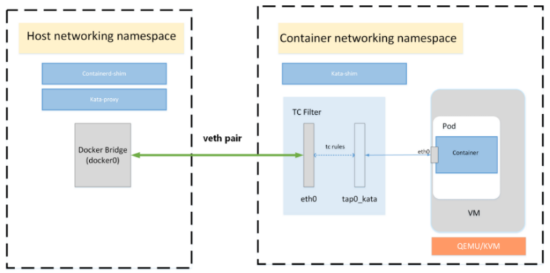
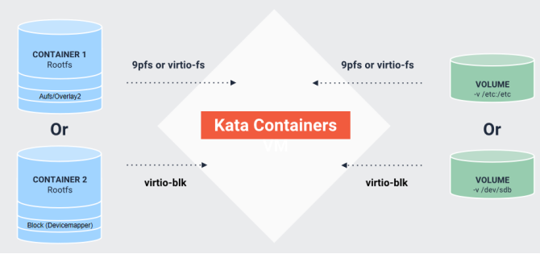
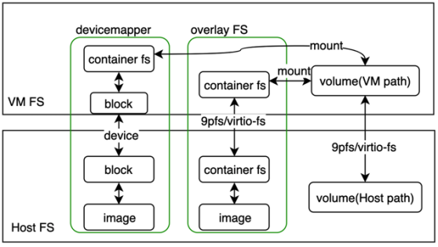

 
[TOC]
# 网络

## 普通容器： 
流程相对比较简单，整个网络分配过程，不需要oci runtime的参与，只要将容器的Network Namespace 传给CNI插件，CNI插件将创建/分配的网络设备放在指定Network Namespace即可，最后以该Network Namespace为基础创建容器；

## kata容器：
由于kata容器的VM层，相对于k8s、CRI Runtime以及CNI插件是透明的，即CNI插件不知道有VM的存在。因此为kata容器分配网络时，实际上前半部分跟普通容器一样，CRI runtime也会创建一个Network Namespace，并传给CNI插件。不同点在于，当CNI插件分配完网络后，kata需要做如下工作：

1. 从监听Network Namespace，获取网络配置信息
2. 建立通往VM的网络设备，如网桥、tap设备
3.  用以创建的设备创建VM，并将网络配置信息（mac, ip, route等）传入VM中，创建相同配置的网卡设备，
4. 在VM中创建容器



- eth0属于veth-pair类型接口，一端接入cni创建的网络命名空间，一端接入宿主机
- tap0_kata属于tap类型接口，一端接入cni创建的网络命名空间，一端接入qemu创建的hypervisor
- 使用tc策略打通eth0网络接口和tap0_kata网络接口

Sandbox环境中只有eth0网络接口，这个接口是qemu和tap模拟出的接口，mac、ip、掩码都和宿主机中cni创建的网络命名空间中eth0的配置一样

Container运行在Sandbox环境中，Container采用共享宿主机网络命名空间方式创建容器，所以在container中看到的网络配置和Sandbox一样

## 网络流量走向：

​		流量进入宿主机后首先由物理网络通过网桥或者路由接入到网络命名空间，网络命名空间中在使用tc策略牵引流量到tap网络接口，然后再通过tap网络接口把流量送入虚拟化环境中，最后虚拟化环境中的容器共享宿主机网络命名空间后就可以在容器中拿到网络流量

```bash
[root@rqy-k8s-1 hff]# ip netns exec cni-c1dea1e8-5df7-f16e-4810-e51d8895ca20 ip a
1: lo: <LOOPBACK,UP,LOWER_UP> mtu 65536 qdisc noqueue state UNKNOWN group default qlen 1000
 link/loopback 00:00:00:00:00:00 brd 00:00:00:00:00:00
 inet 127.0.0.1/8 scope host lo
 valid_lft forever preferred_lft forever
 inet6 ::1/128 scope host
 valid_lft forever preferred_lft forever
2: tunl0@NONE: <NOARP> mtu 1480 qdisc noop state DOWN group default qlen 1000
 link/ipip 0.0.0.0 brd 0.0.0.0
4: eth0@if113: <BROADCAST,MULTICAST,UP,LOWER_UP> mtu 1440 qdisc noqueue state UP group default qlen 1000
 link/ether de:95:a9:f2:89:db brd ff:ff:ff:ff:ff:ff link-netnsid 0
 inet 10.192.181.55/32 scope global eth0
 valid_lft forever preferred_lft forever
 inet6 fe80::dc95:a9ff:fef2:89db/64 scope link
 valid_lft forever preferred_lft forever
5: tap0_kata: <BROADCAST,MULTICAST,UP,LOWER_UP> mtu 1440 qdisc mq state UNKNOWN group default qlen 1000
 link/ether ee:32:c5:ac:30:06 brd ff:ff:ff:ff:ff:ff
 inet6 fe80::ec32:c5ff:feac:3006/64 scope link
 valid_lft forever preferred_lft forever
[root@rqy-k8s-1 hff]# ip netns exec cni-c1dea1e8-5df7-f16e-4810-e51d8895ca20 tc -s qdisc
qdisc noqueue 0: dev lo root refcnt 2
 Sent 0 bytes 0 pkt (dropped 0, overlimits 0 requeues 0)
 backlog 0b 0p requeues 0
qdisc noqueue 0: dev eth0 root refcnt 2
 Sent 0 bytes 0 pkt (dropped 0, overlimits 0 requeues 0)
 backlog 0b 0p requeues 0
qdisc ingress ffff: dev eth0 parent ffff:fff1 ----------------
 Sent 468 bytes 7 pkt (dropped 0, overlimits 0 requeues 0)
 backlog 0b 0p requeues 0
qdisc mq 0: dev tap0_kata root
 Sent 1222 bytes 15 pkt (dropped 0, overlimits 0 requeues 0)
 backlog 0b 0p requeues 0
qdisc pfifo_fast 0: dev tap0_kata parent :1 bands 3 priomap  1 2 2 2 1 2 0 0 1 1 1 1 1 1 1 1
 Sent 1222 bytes 15 pkt (dropped 0, overlimits 0 requeues 0)
 backlog 0b 0p requeues 0
qdisc ingress ffff: dev tap0_kata parent ffff:fff1 ----------------
 Sent 936 bytes 15 pkt (dropped 0, overlimits 0 requeues 0
 backlog 0b 0p requeues 0
[root@rqy-k8s-1 kbuser]# kubectl exec -it hostpath-kata-57477fb8f7-ls6mq sh
/ # ip addr
1: lo: <LOOPBACK,UP,LOWER_UP> mtu 65536 qdisc noqueue qlen 1000
 link/loopback 00:00:00:00:00:00 brd 00:00:00:00:00:00
 inet 127.0.0.1/8 scope host lo
 valid_lft forever preferred_lft forever
 inet6 ::1/128 scope host
 valid_lft forever preferred_lft forever
2: eth0: <BROADCAST,MULTICAST,UP,LOWER_UP> mtu 1440 qdisc fq qlen 1000
 link/ether de:95:a9:f2:89:db brd ff:ff:ff:ff:ff:ff
 inet 10.192.181.55/32 brd 10.192.181.55 scope global eth0
 valid_lft forever preferred_lft forever
 inet6 fe80::dc95:a9ff:fef2:89db/64 scope link
 valid_lft forever preferred_lft forever
```

- calico网络模型网络流向：

-容器流量通过veth pair到达宿主机的网络命名空间上。
-根据容器要访问的IP所在的子网CIDR和主机上的路由规则，找到下一跳要到达的宿主机IP。
-流量到达下一跳的宿主机后，根据当前宿主机上的路由规则，直接到达对端容器的veth pair插在宿主机的一端，最终进入容器。

# 存储

从 Kata Containers 的 2.0 版本开始，virtio-fs是默认的文件系统共享机制。

[storage](https://github.com/kata-containers/kata-containers/blob/main/docs/design/architecture/storage.md)



## 常规容器是怎么为容器准备文件系统并创建容器的

1. 需要根据启动容器的配置，获取容器的镜像，在通过对应的文件系统驱动（overlayfs或devicemapper）获取镜像的每一层信息，为容器创建可写层，并生成mount配置（由containerd完成）；
2. 使用文件系统驱动的机制，将每一层按顺序叠加起来，mount到host上的一个挂载点，构建成文件系统（由containerd-shim完成）；
3. 用构建好的容器文件系统以及容器的配置信息在host上创建容器（由runc完成）。

## kata文件系统

对于kata容器，第一步跟常规容器类似。主要差异在后面的步骤。且对于不同的文件系统驱动，在kata中的处理流程也不同。分为两类devicemapper和其他（如overlay(2)、aufs等）

- devicemapper 由于该文件系统驱动将容器和镜像的每一层都做成有依赖关系的快照，最终的结果是一个block设备，因此，在kata内部，会将该设备直接传给VM，并在VM中将其挂载到目标挂载点，形成容器的文件系统，并在VM中创建容器，其中VM外部的操作由kata-runtime（shim v1）或 kata-contaienrs-shimv2(shim v2)完成，VM内部有kata-agent完成。

- 其他（如overlay(2)、aufs等） 对于非devicemapper的文件系统驱动，由于在host中，已经形成了文件系统，而非设备，因此只能通过某种方式，让VM可以访问host中的容器文件系统，并在VM中创建容器。在kata中，前期主要使用了9pfs技术，由于使用了类似远程访问，因此，容器对于文件系统的读写性能较差。在最近的版本中，增加了virtio-fs(共享文件系统)技术，来改善读写性能。

- 除了容器文件系统本身，容器还可以配置volume，即可以将host上的某个目录挂载到容器中，供容器使用，这对于普通容器相对比较容器。 对于kata容器，由于voluem本身是host上的一个路径，因此也是常规文件系统，因此，也需要通过9pfs或virtio-fs技术，将该路径映射到VM中，再将其挂载的对应的容器文件系统。

## virtio-9p 和 virtio-fs 文件系统对比

1. virtio-9p 没有针对虚拟化场景提供优化
2. virtio-fs 利用了 hypervisor 和虚拟机处于相同节点的优势
3. DAX 特性，文件内容映射到宿主机的内存窗口，客户机直接访问宿主机的 page cache
   - 减少内存占用，因为客户机 cache 已经被绕过了
4. 相比 virtio-9p，virtio-fs 具有更好的 POSIX 合规性

## virtiofs



### virtiofsd已知问题汇总

[https://github.com/kata-containers/runtime/issues/2797](https://github.com/kata-containers/runtime/issues/2797)

### virtiofsd cache guest

guest ⽣成是会指定内存⼤⼩，virtiofsd会共享使⽤guest的内存。默认使⽤memory-backend-fifile内存对象

virtiofsd共享使⽤VM内存，configuration.toml 配置参数default_memory

### DAX: virtio_fs_cache_size

Kata Containers 利用 Linux 内核 DAX（直接访问文件系统）功能将某些主机端文件有效地映射到虚拟机 VM 空间。特别是，Kata Containers 使用 QEMU NVDIMM 功能来提供内存映射的虚拟设备，该设备可用于 DAX 将虚拟机的根文件系统映射到来宾内存地址空间。

与更传统的 VM 文件和设备映射机制相比，使用 DAX 映射文件具有许多优点：

映射为直接访问设备允许虚拟机直接访问主机内存页面（例如通过就地执行（XIP）），而忽略虚拟机页面缓存。这提供了时间和空间优化。

通过映射为 VM 内部的直接访问设备，可以使用页面错误从主机加载页面，而不必通过虚拟设备发出请求（导致昂贵的 VM 退出/超调用），从而提供了速度优化。

通过在主机上使用 MAP_SHARED 共享内存，主机可以有效地共享页面。

Kata Containers 使用以下步骤来设置 DAX 映射：

- QEMU 配置了 NVDIMM 内存设备，并带有后端的内存文件以将主机端文件映射到虚拟 NVDIMM 空间。

- 虚拟机内核命令行在启用了 DAX 功能的情况下挂载此 NVDIMM 设备，从而允许直接页面映射和访问，从而绕过了虚拟机页面缓存。

```sh
[root@rqy-k8s-1 kbuser]# cat /opt/kata/share/defaults/kata-containers/configuration.toml | grep virtio_fs_cache_size
virtio_fs_cache_size = 0
```

[http://www.elecfans.com/d/1663583.html](http://www.elecfans.com/d/1663583.html)

## devicemap块存储


## containerd的Snapshotter

Snapshot为containerd实现了Snapshotter用于管理文件系统上容器镜像的快照和容器的rootfs挂载和卸载等操作功能。 snapshotter对标Docker中的graphdriver存储驱动的设计。

[https://blog.mobyproject.org/where-are-containerds-graph-drivers-145fc9b7255](https://blog.mobyproject.org/where-are-containerds-graph-drivers-145fc9b7255)
# 参考资料
[https://blog.csdn.net/u010827484/article/details/117488338](https://blog.csdn.net/u010827484/article/details/117488338)
[https://github.com/kata-containers/kata-containers/blob/main/docs/design/architecture/networking.md](https://github.com/kata-containers/kata-containers/blob/main/docs/design/architecture/networking.md)
[http://miaoyq.com/kata-containers-share/](http://miaoyq.com/kata-containers-share/)