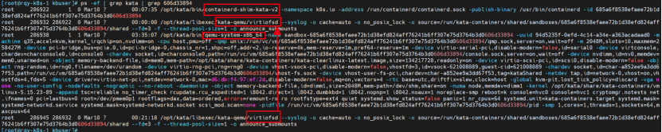
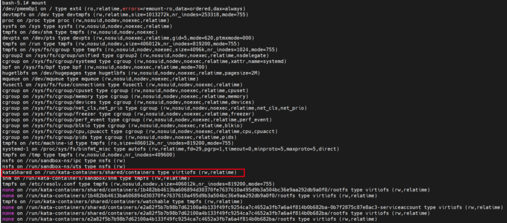

[TOC]


# 创建一个kata容器
```bash
[root@rqy-k8s-1 hff]# kubectl get deployments.apps

NAME              READY   UP-TO-DATE   AVAILABLE   AGE

hostpath-kata     1/1     1            1           151m

[root@rqy-k8s-1 hff]# kubectl get pod

NAME                               READY   STATUS              RESTARTS   AGE

hostpath-kata-57477fb8f7-ls6mq     1/1     Running             0          91m

[root@rqy-k8s-1 hff]# kubectl top pod hostpath-kata-57477fb8f7-ls6mq

NAME                             CPU(cores)   MEMORY(bytes)

hostpath-kata-57477fb8f7-ls6mq   0m           0Mi

[root@rqy-k8s-1 hff]# kubectl describe node | grep hostpath-kata

 default                     hostpath-kata-57477fb8f7-ls6mq                0 (0%)        0 (0%)      0 (0%)           0 (0%)          93m
```
## crictl pods
```bash

[root@rqy-k8s-1 hff]# crictl pods

POD ID              CREATED             STATE               NAME                                         NAMESPACE              ATTEMPT             RUNTIME

1b482bb4613ba       2 hours ago         Ready               hostpath-kata-57477fb8f7-ls6mq               default                0                   kata
```
## crictl ps
```bash
[root@rqy-k8s-1 hff]# crictl ps

CONTAINER           IMAGE               CREATED             STATE               NAME                        ATTEMPT             POD ID

e2a82f5b7b98b       2fb6fc2d97e10       2 hours ago         Running             hostpath-kata               0                   1b482bb4613ba
```
## crictl stats
```bash
[root@rqy-k8s-1 hff]# crictl stats e2a82f5b7b98b

CONTAINER           CPU %               MEM                 DISK                INODES

e2a82f5b7b98b       0.00                397.3kB             4.096kB             15
```
## 获取sandboxID
```bash
[root@rqy-k8s-1 hff]# crictl inspect e2a82f5b7b98b | grep sandboxID
 "sandboxID": "1b482bb4613ba606894d30370fe7637610a495d9b3a504bc36e9aa292db9a0f0",
```
## 宿主机进程


```bash
[root@rqy-k8s-1 kbuser]# ps -ef | grep 6d46a824dae01c4675da741ca2aff98b1e7eb005103d10cf0c3af6f758c97afe

root      27665  25163  0 15:16 pts/1    00:00:00 grep --color=auto 6d46a824dae01c4675da741ca2aff98b1e7eb005103d10cf0c3af6f758c97afe

root     275424      1  0 Mar10 ?        00:07:38 /opt/kata/bin/containerd-shim-kata-v2 -namespace k8s.io -address /run/containerd/containerd.sock -publish-binary /usr/bin/containerd -id 6d46a824dae01c4675da741ca2aff98b1e7eb005103d10cf0c3af6f758c97afe

root     275433 275424  0 Mar10 ?        00:00:00 /opt/kata/libexec/kata-qemu/virtiofsd --syslog -o cache=auto -o no_posix_lock -o source=/run/kata-containers/shared/sandboxes/6d46a824dae01c4675da741ca2aff98b1e7eb005103d10cf0c3af6f758c97afe/shared --fd=3 -f --thread-pool-size=1 -o announce_submounts

root     275439      1 99 Mar10 ?        18-20:24:19 /opt/kata/bin/qemu-system-x86_64 -name sandbox-6d46a824dae01c4675da741ca2aff98b1e7eb005103d10cf0c3af6f758c97afe -uuid def243a2-c731-490f-a9ef-926546ff62d5 -machine q35,accel=kvm,kernel_irqchip=on,nvdimm=on -cpu host,pmu=off -qmp unix:/run/vc/vm/6d46a824dae01c4675da741ca2aff98b1e7eb005103d10cf0c3af6f758c97afe/qmp.sock,server=on,wait=off -m 2048M,slots=10,maxmem=258427M -device pci-bridge,bus=pcie.0,id=pci-bridge-0,chassis_nr=1,shpc=off,addr=2,io-reserve=4k,mem-reserve=1m,pref64-reserve=1m -device virtio-serial-pci,disable-modern=false,id=serial0 -device virtconsole,chardev=charconsole0,id=console0 -chardev socket,id=charconsole0,path=/run/vc/vm/6d46a824dae01c4675da741ca2aff98b1e7eb005103d10cf0c3af6f758c97afe/console.sock,server=on,wait=off -device nvdimm,id=nv0,memdev=mem0,unarmed=on -object memory-backend-file,id=mem0,mem-path=/opt/kata/share/kata-containers/kata-clearlinux-latest.image,size=134217728,readonly=on -device virtio-scsi-pci,id=scsi0,disable-modern=false -object rng-random,id=rng0,filename=/dev/urandom -device virtio-rng-pci,rng=rng0 -device vhost-vsock-pci,disable-modern=false,vhostfd=3,id=vsock-1984865782,guest-cid=1984865782 -chardev socket,id=char-322c78f952d627ce,path=/run/vc/vm/6d46a824dae01c4675da741ca2aff98b1e7eb005103d10cf0c3af6f758c97afe/vhost-fs.sock -device vhost-user-fs-pci,chardev=char-322c78f952d627ce,tag=kataShared -netdev tap,id=network-0,vhost=on,vhostfds=4,fds=5 -device driver=virtio-net-pci,netdev=network-0,mac=86:aa:b6:3f:ee:47,disable-modern=false,mq=on,vectors=4 -rtc base=utc,driftfix=slew,clock=host -global kvm-pit.lost_tick_policy=discard -vga none -no-user-config -nodefaults -nographic --no-reboot -daemonize -object memory-backend-file,id=dimm1,size=2048M,mem-path=/dev/shm,share=on -numa node,memdev=dimm1 -kernel /opt/kata/share/kata-containers/vmlinux-5.15.23-89 -append tsc=reliable no_timer_check rcupdate.rcu_expedited=1 i8042.direct=1 i8042.dumbkbd=1 i8042.nopnp=1 i8042.noaux=1 noreplace-smp reboot=k console=hvc0 console=hvc1 cryptomgr.notests net.ifnames=0 pci=lastbus=0 root=/dev/pmem0p1 rootflags=dax,data=ordered,errors=remount-ro ro rootfstype=ext4 quiet systemd.show_status=false panic=1 nr_cpus=64 systemd.unit=kata-containers.target systemd.mask=systemd-networkd.service systemd.mask=systemd-networkd.socket scsi_mod.scan=none -pidfile /run/vc/vm/6d46a824dae01c4675da741ca2aff98b1e7eb005103d10cf0c3af6f758c97afe/pid -smp 1,cores=1,threads=1,sockets=64,maxcpus=64

root     275447 275433  0 Mar10 ?        00:11:47 /opt/kata/libexec/kata-qemu/virtiofsd --syslog -o cache=auto -o no_posix_lock -o source=/run/kata-containers/shared/sandboxes/6d46a824dae01c4675da741ca2aff98b1e7eb005103d10cf0c3af6f758c97afe/shared --fd=3 -f --thread-pool-size=1 -o announce_submounts
```


## ip netns exec cni-c1dea1e8-5df7-f16e-4810-e51d8895ca20 ip a
```bash
[root@rqy-k8s-1 hff]# ip netns exec cni-c1dea1e8-5df7-f16e-4810-e51d8895ca20 ip a

1: lo: <LOOPBACK,UP,LOWER_UP> mtu 65536 qdisc noqueue state UNKNOWN group default qlen 1000

 link/loopback 00:00:00:00:00:00 brd 00:00:00:00:00:00

 inet 127.0.0.1/8 scope host lo

 valid_lft forever preferred_lft forever

 inet6 ::1/128 scope host

 valid_lft forever preferred_lft forever

2: tunl0@NONE: <NOARP> mtu 1480 qdisc noop state DOWN group default qlen 1000

 link/ipip 0.0.0.0 brd 0.0.0.0

4: eth0@if113: <BROADCAST,MULTICAST,UP,LOWER_UP> mtu 1440 qdisc noqueue state UP group default qlen 1000

 link/ether de:95:a9:f2:89:db brd ff:ff:ff:ff:ff:ff link-netnsid 0

 inet 10.192.181.55/32 scope global eth0

 valid_lft forever preferred_lft forever

 inet6 fe80::dc95:a9ff:fef2:89db/64 scope link

 valid_lft forever preferred_lft forever

5: tap0_kata: <BROADCAST,MULTICAST,UP,LOWER_UP> mtu 1440 qdisc mq state UNKNOWN group default qlen 1000

 link/ether ee:32:c5:ac:30:06 brd ff:ff:ff:ff:ff:ff

 inet6 fe80::ec32:c5ff:feac:3006/64 scope link

 valid_lft forever preferred_lft forever

## **ip netns exec cni-c1dea1e8-5df7-f16e-4810-e51d8895ca20 tc -s qdisc**

qdisc noqueue 0: dev lo root refcnt 2

 Sent 0 bytes 0 pkt (dropped 0, overlimits 0 requeues 0)

 backlog 0b 0p requeues 0

qdisc noqueue 0: dev eth0 root refcnt 2

 Sent 0 bytes 0 pkt (dropped 0, overlimits 0 requeues 0)

 backlog 0b 0p requeues 0

qdisc ingress ffff: dev eth0 parent ffff:fff1 ----------------

 Sent 468 bytes 7 pkt (dropped 0, overlimits 0 requeues 0)

 backlog 0b 0p requeues 0

qdisc mq 0: dev tap0_kata root

 Sent 1222 bytes 15 pkt (dropped 0, overlimits 0 requeues 0)

 backlog 0b 0p requeues 0

qdisc pfifo_fast 0: dev tap0_kata parent :1 bands 3 priomap  1 2 2 2 1 2 0 0 1 1 1 1 1 1 1 1

 Sent 1222 bytes 15 pkt (dropped 0, overlimits 0 requeues 0)

 backlog 0b 0p requeues 0

qdisc ingress ffff: dev tap0_kata parent ffff:fff1 ----------------

 Sent 936 bytes 15 pkt (dropped 0, overlimits 0 requeues 0)

 backlog 0b 0p requeues 0
```

## 宿主机目录
>/run/kata-containers/shared/sandboxes/
>/run/vc/vm/
>/run/vc/sbs/
>/sys/fs/cgroup/(memory、devices、cpu,cpuacct...)
>/sys/fs/cgroup/systemd/kata_overhead/
>/app/docker/containerd/

## vm_pid

```bash
ctr -n k8s.io run --runtime io.containerd.kata.v2 -t --rm docker.io/dotnetdr/sysbench:0.5 hfftest sh

[root@localhost sysbench]# cat /proc/20092/status

Name:   qemu-system-x86

Umask:  0027

State:  S (sleeping)

Tgid:   20092

Ngid:   0

Pid:    20092

PPid:   1

TracerPid:      0

Uid:    0       0       0       0

Gid:    0       0       0       0

FDSize: 128

Groups:

VmPeak:  2537664 kB

VmSize:  2535372 kB

VmLck:         0 kB

VmPin:         0 kB

VmHWM:    129616 kB

VmRSS:     92404 kB

RssAnon:           13932 kB

RssFile:             624 kB

RssShmem:          77848 kB

VmData:   251424 kB

VmStk:       132 kB

VmExe:      8460 kB

VmLib:         0 kB

VmPTE:       544 kB

VmSwap:        0 kB

Threads:        4

SigQ:   2/30632

SigPnd: 0000000000000000

ShdPnd: 0000000000000000

SigBlk: 0000000010002240

SigIgn: 0000000000381000

SigCgt: 0000000180004243

CapInh: 0000000000000000

CapPrm: 0000001fffffffff

CapEff: 0000001fffffffff

CapBnd: 0000001fffffffff

CapAmb: 0000000000000000

NoNewPrivs:     0

Seccomp:        0

Speculation_Store_Bypass:       thread vulnerable

Cpus_allowed:   ff

Cpus_allowed_list:      0-7

Mems_allowed:   00000000,00000000,00000000,00000000,00000000,00000000,00000000,00000000,00000000,00000000,00000000,00000000,00000000,00000000,00000000,00000000,00000000,00000000,00000000,00000000,00000000,00000000,00000000,00000000,00000000,00000000,00000000,00000000,00000000,00000000,00000000,00000001

Mems_allowed_list:      0

voluntary_ctxt_switches:        443

nonvoluntary_ctxt_switches:     4
```

# 进入kata容器
```bash

[root@rqy-k8s-1 kbuser]# kubectl exec -it hostpath-kata-57477fb8f7-ls6mq sh

/ #

/ #
```

## df -h
```bash

root@hostpath-kata-7949f86f8c-8gfqj:/# df -h

Filesystem      Size  Used Avail Use% Mounted on

none            494G   28G  466G   6% /

tmpfs            64M     0   64M   0% /dev

tmpfs           992M     0  992M   0% /sys/fs/cgroup

none            494G   28G  466G   6% /hff

kataShared      494G   28G  466G   6% /etc/hosts

shm             992M     0  992M   0% /dev/shm

tmpfs           992M   12K  992M   1% /run/secrets/kubernetes.io/serviceaccount
```
## lsblk
```bash

root@hostpath-kata-7949f86f8c-8gfqj:/# lsblk

NAME      MAJ:MIN RM  SIZE RO TYPE MOUNTPOINT

pmem0     259:0    0  126M  1 disk

`-pmem0p1 259:1    0  124M  1 part
```
## ip addr
```bash
/ # ip addr

1: lo: <LOOPBACK,UP,LOWER_UP> mtu 65536 qdisc noqueue qlen 1000

 link/loopback 00:00:00:00:00:00 brd 00:00:00:00:00:00

 inet 127.0.0.1/8 scope host lo

 valid_lft forever preferred_lft forever

 inet6 ::1/128 scope host

 valid_lft forever preferred_lft forever

2: eth0: <BROADCAST,MULTICAST,UP,LOWER_UP> mtu 1440 qdisc fq qlen 1000

 link/ether 3a:ba:39:45:0b:fb brd ff:ff:ff:ff:ff:ff

 inet 10.192.181.54/32 brd 10.192.181.54 scope global eth0

 valid_lft forever preferred_lft forever

 inet6 fe80::38ba:39ff:fe45:bfb/64 scope link

 valid_lft forever preferred_lft forever
```


## mount
```bash
root@netperf-server-kata:/# mount

none on / type virtiofs (rw,relatime)

proc on /proc type proc (rw,nosuid,nodev,noexec,relatime)

tmpfs on /dev type tmpfs (rw,nosuid,size=65536k,mode=755)

devpts on /dev/pts type devpts (rw,nosuid,noexec,relatime,gid=5,mode=620,ptmxmode=666)

mqueue on /dev/mqueue type mqueue (rw,nosuid,nodev,noexec,relatime)

sysfs on /sys type sysfs (ro,nosuid,nodev,noexec,relatime)

tmpfs on /sys/fs/cgroup type tmpfs (ro,nosuid,nodev,noexec,relatime)

cgroup on /sys/fs/cgroup/pids type cgroup (ro,nosuid,nodev,noexec,relatime,pids)

cgroup on /sys/fs/cgroup/net_cls,net_prio type cgroup (ro,nosuid,nodev,noexec,relatime,net_cls,net_prio)

cgroup on /sys/fs/cgroup/blkio type cgroup (ro,nosuid,nodev,noexec,relatime,blkio)

cgroup on /sys/fs/cgroup/devices type cgroup (ro,nosuid,nodev,noexec,relatime,devices)

cgroup on /sys/fs/cgroup/memory type cgroup (ro,nosuid,nodev,noexec,relatime,memory)

cgroup on /sys/fs/cgroup/cpuset type cgroup (ro,nosuid,nodev,noexec,relatime,cpuset)

cgroup on /sys/fs/cgroup/cpu,cpuacct type cgroup (ro,nosuid,nodev,noexec,relatime,cpu,cpuacct)

cgroup on /sys/fs/cgroup/systemd type cgroup (rw,nosuid,nodev,noexec,relatime,xattr,name=systemd)

cgroup on /sys/fs/cgroup/perf_event type cgroup (ro,nosuid,nodev,noexec,relatime,perf_event)

cgroup on /sys/fs/cgroup/freezer type cgroup (ro,nosuid,nodev,noexec,relatime,freezer)

kataShared on /etc/hosts type virtiofs (rw,relatime)

kataShared on /dev/termination-log type virtiofs (rw,relatime)

kataShared on /etc/hostname type virtiofs (rw,relatime)

kataShared on /etc/resolv.conf type virtiofs (rw,relatime)

shm on /dev/shm type tmpfs (rw,relatime)

tmpfs on /run/secrets/kubernetes.io/serviceaccount type tmpfs (ro,relatime)

tmpfs on /proc/timer_list type tmpfs (rw,nosuid,size=65536k,mode=755)

proc on /proc/bus type proc (ro,relatime)

proc on /proc/fs type proc (ro,relatime)

proc on /proc/irq type proc (ro,relatime)

proc on /proc/sys type proc (ro,relatime)
```
# 进入kata vm
```bash
[root@rqy-k8s-1 kbuser]# kata-runtime exec 1b482bb4613ba606894d30370fe7637610a495d9b3a504bc36e9aa292db9a0f0

bash: grep: command not found

bash: grep: command not found

bash: tty: command not found

bash: expr: command not found

bash: [: : integer expression expected

bash-5.1#

bash-5.1#
```
## lsblk
```bash
bash-5.1# lsblk
NAME      MAJ:MIN RM  SIZE RO TYPE MOUNTPOINTS
pmem0     259:0    0  126M  1 disk
`-pmem0p1 259:1    0  124M  1 part /
bash-5.1#
```
## mount

