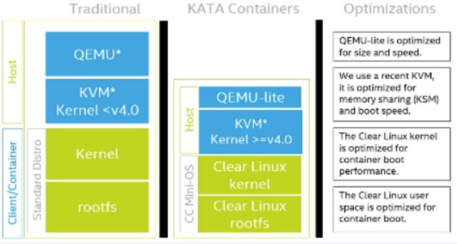

 [TOC]
# 安全容器-Kata containers
​	安全容器4类方案：
- 传统OS容器配合安全机制（runc + SELinux, AppArmor, … + rootless mode）
- 用户态内核的容器（Google的gVisor）
- Library OS（UniKernel、Nabla Containers）
- 轻量虚拟化的容器（Kata Containers、Firecracker）。

​		Kata Containers项目来自于2017年12月合并的两个项目“IntelClear Containers”和“Hyper runV”，其目标是构建极其轻量级的VM，它们像容器一样执行，但提供工作负载隔离和添加虚拟机层的安全优势。

​		KataContainers社区于2018年5月发布了第一版1.0。由于Kata容器运行时兼容OCI，它可以无缝地插入Docker引擎和任何其他容器管理平台，如Kubernetes和Open-Stack，只需简单地将RUNC替换为Kata-runtime。

​		Kata Containers 的本质就是一个精简后的轻量级虚拟机。

## The speed of containers, the security of VMs

安全体现在: 

在专用内核中运行，提供网络、I/O 和内存的隔离，并且可以利用硬件强制隔离和虚拟化 VT 扩展。

容器体现在：

兼容性上：支持OCI以及CRI接口，和容器一样操作。
性能上：启动速度达到百毫秒级，接近容器。
开销上：内存开销小，类似容器。
与Kubernetes和Docker无缝衔接，并且是runc的替代品
开源基础设施基金会下的开源治理项目
多架构支持：x86、ARM、IBM Power、IBM s/390x

## 项目思路：
1. 操作系统本身的容器机制没办法解决安全性问题，需要一个隔离层；
2. 虚拟机是一个现成的隔离层，AWS这样的云服务已经让全世界相信，对户来说，"secure of VM" 是可以满足需求的；
3. 虚机里面只要有个内核，就可以支持 OCI 规范的语义，在内核上跑个 Linux 应用这并不太难实现；
4. 虚机可能不够快，阻碍了它在容器环境的应用，那么可不可以拥有 "speed of container" 呢？
现在，如果最后一个问题可以解决，那么它就是我们要的“安全的容器”了——这就是 Kata Containers。
 

## 安全隔离

安全性问题90%以上可以归结为隔离性问题

- Docker安全隔离问题[[]]

- 在Kata Containers中，每个容器都有自己的轻量级虚拟机和小内核，通过硬件虚拟化提供容器隔离。

## kata隔离效益

​		kata 实际上是通过创建轻量级虚拟机实现容器之间的资源隔离，再在虚拟机中运行容器运行时，这样就使容器在专用内核中运行，提供网络，I / O和内存的隔离，并可以通过虚拟化VT扩展利用硬件强制隔离。

传统的操作系统容器技术是内核进程管理的一个延伸，容器进程本身是一组关联的进程，对于宿主机的调度器来说是完全可见的，一个 Pod 里的所有容器或进程，同时也都被宿主机调度和管理。这就意味着，在有大量容器的环境下，宿主机内核的负担很重。而采纳安全容器之后，从宿主机上是看不到这些完整的信息的，隔离层同时也降低了宿主机的调度开销，减少了维护负担，避免了容器之间、容器和宿主机之间的服务质量干扰。

安全容器作为一道屏障，可以让宿主机的运维管理操作不能直接访问到应用的数据，这样，把用户的应用数据直接保护在沙箱里就可以降低对用户的授权要求，保障用户的数据私密性。


 

## 减少虚拟化开销

- 通过“少用不必要的内存”和“共享能共享的内存”来降低内存的开销，更小的内存不仅开销更小，启动也更轻快

- 最关键的性能优化来自Intel Clear Containers。

- 最关键的优化其实就是VM的启动时间进行裁剪，优化。

- 使用特定的Linux内核，使用简化的initrd以及rootfs。


## 怎样接上容器的生态

​		kata-containers它本质上就一个容器的runtime。只要实现了OCI的接口就可以接上那些容器管理工具，只要实现了CRI接口，就可以接上k8s。

​		所以kata-containers与OCI运行时规范兼容，可以通过CRI-O和Containerd实现与 Kubernetes CRI进行无缝协作。（Shim API）

## 和传统的runC的区别
​		最大的区别就在于container是放在虚拟机里面运行的，中间多了一层kernel后，外面的容器管理软件就无法管理，监控里面的进程、容器，也无法和里面通信。 解决方案就是在VM里面放了一个agent，内外通过VSOCK通信，这样子内外就打通了。

## 使用场景

- 主要使用场景是在公有云模式

- 裸金属基础设施

- 混合工作负载生产环境

- 监管和敏感的生产环境

- 多租户容器集群

- 具有内核相关功能的遗留的依赖内核的工作负载

# 架构（Kata2.0）
[architecture](https://github.com/kata-containers/kata-containers/tree/main/docs/design/architecture)


- Kata Containers 的虚拟机里会有一个特殊的 Init 进程负责管理虚拟机里面的用户容器，并且只为这些容器开启 Mount Namespace。所以，这些用户容器之间，原生就是共享 Network 以及其他 Namespace 的。
- 此外，为了跟上层编排框架比如 Kubernetes 进行对接，Kata Containers 项目会启动一系列跟用户容器对应的 shim 进程，来负责操作这些用户容器的生命周期。当然，这些操作，实际上还是要靠虚拟机里的 Init 进程来帮你做到。
- 为了能够对这个虚拟机的 I/O 性能进行优化，Kata Containers 也会通过 vhost 技术（比如：vhost-user）来实现 Guest 与 Host 之间的高效的网络通信，并且使用 PCI Passthrough （PCI 穿透）技术来让 Guest 里的进程直接访问到宿主机上的物理设备。


## Kata Containers 2.x vs 1.x


2.x 在开发上主要有以下几个重大的变更点：

- agent 使用 Rust 重写

- 只支持 shimv2，因此少了 proxy 和 shim 组件, shimv2 提供了 Containerd Runtime V2 (Shim API) 的 Kata 实现，从而使得 Kubernetes 场景下能够实现每个 Pod 一个 shim 进程 – shimv2。

- 在 Kata Containers 2.x 中，核心组件只剩下两个：runtime 和agent ，且都在 kata-containers 这个 repo 下。

在kata1.x， kata-container可以当做docker的一个插件，启动kata-container可以通过docker命令，但是kata2.x之后，kata去掉了docker的cli，不能通过docker启动kata runtime容器。

在 Kata 1.x 中，面向用户的主要组件是运行时（kata-runtime）。对于 Kata 2.0，主要组件是 Kata containerd shim v2。 对“ Kata 运行时”的任何提及均应指代 Kata containerd shim v2。

## 启动运行流程
docker/kubelet通过接口调用containerd-shim-kata-v2创建pod/container，
container-shim-kata-v2为每个容器/pod创建一个QEMU/KVM虚拟机。
虚拟机中启动一个极简的kernel，最终运行一个用户态程序kata-agent。kata-agent通过VSOCK向host上暴露一个gRPC接口，container-shim-kata-v2通过这个接口连接上kata-agent，进而实现对虚拟机内部的管理。这个gRPC接口既用于传输管理命令，也用于传输stdin，stdout，stderr等流。
kata-agent在虚拟机中通过libcontainer管理container。启动container所需要的OCI bundle可以通过block device或者mount point的形式从host上挂上去。

**关于虚拟机在host上的存在形式：**

一个QEMU/KVM虚拟机本质上就是host上的一个进程
虚拟机的一个VCPU本质上是host的一个线程，虚拟机进程中除了VCPU线程还有IO管理等线程。 * 虚拟机使用的内存来自进程的虚拟地址空间。
这边的agent干的事情和runC基本上是差不多的，区别就在于它要知道自己是在一个VM里面，并且和再上一层的软件通信要走VSOCK。

## 接口调用

- 提交创建请求
- api server将api对象被存储到etcd
- Controller manager创建pod
- Scheduler监听pod变化，执行调度，绑定节点
- Kubelet监听pod绑定事件，接管pod> 通过CRI接口找到 containerd或者cri-o（这里kubelet作为cri client）
- Containerd将cri请求变成一个OCI spec，交给oci runtime(即containerd-shim-kata-v2)：当 containerd 拿到一个请求的时候，它会首先创建一个 shim-v2（PodSandbox）,每一个 Pod 都会有一个 shim-v2 来为 containerd/CRI-O 来执行各种各样的操作。
- shim-v2 会为这个 Pod 启动一个虚拟机，在里面运行着一个 linux kernel

>- 当用户指定运行时名称时， containerd 将其转换为 shim 的二进制名称，如：io.containerd.runc.v1->containerd-shim-runc-v1或io.containerd.kata.v2->containerd-shim-kata-v2；
>- 每个shim必须实现一个start子命令。此命令将启动新的shims。
>- 启动命令必须向 shim 返回一个地址，以便 containerd 为容器操作发出 API 请求。


- 然后我们会把这个容器的 spec 以及这个容器本身打包的存储，包括 rootfs 和文件系统，交给这个PodSandbox。这个 PodSandbox 会在虚机中由 kata-agent 把容器启动起来；

- kata-agent 生成容器进程，kata-agent 是在虚拟机内部作为守护程序运行的代理进程。kata-agent 使用 VIRTIO 串行或 VSOCK 接口在虚拟机中运行 ttRPC 服务器，该接口由 QEMU 生成一个 Socket 文件暴露给宿主机。shimv2 使用 ttRPC 协议与代理进程进行通信。该协议允许运行时将容器管理命令发送到代理进程。该协议还用于在容器和管理引擎（例如 CRI-O 或 Containerd）之间承载 I/O 流（stdout，stderr，stdin）。

- 对于任何给定的容器，该容器中的初始化过程和所有可能执行的命令以及它们相关的 I/O 流都需要通过 QEMU 导出的 VSOCK 接口。


注：
> 在 shimv2 之前 Kata 1.x，我们需要为每个容器和 Pod 沙箱本身创建一个 containerd-shim 和 kata-shim，以及在 VSOCK 不可用时创建一个可选的 kata-proxy。借助 shimv2，Kubernetes 可以启动 Pod 和 OCI 兼容的容器，每个 Pod 可以使用一个 Shim（shimv2）而不是 2N+1 Shim，并且即使没有 VSOCK 也不用使用独立的 kata-proxy 程序。


```bash
root     22324  0.0  0.2 946312 23760 ?        Sl   Apr12   0:21 /opt/kata/bin/containerd-shim-kata-v2 -namespace k8s.io -address /run/containerd/containerd.sock -publish-binary /usr/bin/containerd -id 3b54b3b02fc7f6905d01aedfc4eb209cfb11fd9136006ed6e11e1e26c0f48562
root     26580  0.0  0.0 113364  5276 ?        Sl   Apr12   0:24 /usr/bin/containerd-shim-runc-v2 -namespace k8s.io -id 721153525c46112a713cbca788389791eb2a6e5ad526f43df162fc4cf7656c44 -address /run/containerd/containerd.sock
```


## kata-agent

https://github.com/kata-containers/kata-containers/tree/main/src/agent


## 虚拟化技术
 kata sanbox/vm的接口
在虚拟机中，我们需要提供以下virtio设备：(qemu)
- 存储(virtio-fs)
- 网络(tap): 基于性能考虑，qemu默认为vhost-net作为virtio-net 后端，默认配置还在评估中。
- 控制（virtio-vsock）
- 设备驱动（vfio）:设备直通
- 动态资源管理(acpi): CPU、内存和设备热插拔

### hypervisor
Kata Containers 支持多个ypervisor

- QEMU 是一个成熟而复杂的管理程序。

- Firecracker 是AWS 为无服务器场景开发的轻量级hypervisor。它只支持有限的虚拟设备。

- Cloud-Hypervisor 是英特尔针对云原生场景设计的另一款轻量级hypervisor。

- ACRN 是针对边缘场景开发的hypervisor。

```bash
[root@localhost ~]#  kata-runtime kata-env | awk -v RS= '/\[Hypervisor\]/' | grep Path
  Path = "/opt/kata/bin/qemu-system-x86_64"
```

#### qemu-system-x86_64

### cgroup
[[kata cgroup]]


### 客户机内核和镜像
[[guest kernel和guestos]]

### 网络和存储
[[kata网络和存储文件系统分析]]
### CPU和内存
[[kata CPU和内存]]

### VSOCK

[Vsock](https://github.com/kata-containers/kata-containers/blob/main/docs/design/VSocks.md)

### kata monitor
[[kata-monitor监控指标]]


## 技术要点总结

- VM作为安全沙箱

- 支持多种虚拟化方案，qemu、firecracker、cloud-hypervisor等

- vm中agent负责直接创建、更新、销毁容器

- 使用vsock作为shim v2进程与agent的通信信道

- 使用tc规则/macvtap连接veth和tap，来打通CNI和VM网络

- 通过virtio-9p、virtio-fs将host上镜像挂载到vm中

- 通过块设备透传，将host上块设备作为容器rootfs

**主要解决的问题：现有容器网络模型与现有虚拟机网络模型不匹配的问题，将CNI网络和虚机网络对接weth和tap连通方案：**

1. tcfilter：使用tc rules将veth的ingress和egress队列分别对接tap的egress和ingress队列实现veth和tap的直连

2. macvtap：现有虚拟网卡连通技术

## 部署组件：

**部署在主机上的：**

- cloud-hypervisor, firecracker, qemu, 和支持的二进制文件

- containerd-shim-kata-v2

- kata-collect-data.sh

- kata-runtime

**镜像:**

- kata-containers.img和kata-containers-initrd.img：从 Kata GitHub 发布页面中提取

- vmlinuz.container和vmlinuz-virtiofs.container：从 Kata GitHub 发布页面中提取

 

## 容器创建流程

- 用户创建容器

- 容器管理器（containerd）创建kata runtime

- kata-runtime加载配置文件，调用shimv2 API 

- kata-runtime运行hypervisor

- hypervisor创建和开启虚拟机VM（创建容器根环境rootfs）

- proxy作为 VM 引导的一部分启动

- 运行时调用proxy的CreateSandboxAPI 请求proxy创建容器

- 容器管理器将容器的控制权返回给运行ctr命令的用户

[[一个kata容器的创建示例]]

# 限制与约束:

**参考资料：**

[https://github.com/kata-containers/kata-containers/blob/main/docs/Limitations.md](https://github.com/kata-containers/kata-containers/blob/main/docs/Limitations.md)

## 环境要求：

- Kata Containers 需要嵌套虚拟化或裸机

- 不支持k8s使用docker运行时，需要切换成containerd或cri-o

## 对资源管理的一些影响

- 无法进行container级别的控制 首先虚拟机本身就是host上的一个进程，仍然受host上的cgroup控制。所以仍然可以监控整个pod的资源使用数据，并控制pod的资源使用。 但是我们无法拿到container级别的数据，也无法直接通过host的cgroup来控制pod里面container的资源使用。

- 虚拟化技术的一些影响

- 虚拟化的overhead

## 存储限制：
Kata 不支持 k8s subPath (emptydir?)

[https://github.com/kata-containers/runtime/issues/2812](https://github.com/kata-containers/runtime/issues/2812)

[https://github.com/kata-containers/kata-containers/issues/1728](https://github.com/kata-containers/kata-containers/issues/1728)

实测configmap没有问题，可能只对于emptydir使用有问题?

## 主机资源共享问题

RUNC可以启动一个容器以特权模式访问主机设备，而Kata-runtime也支持此选项，但在这种情况下，获得对客户VM设备的完全访问。尽管这个选项被视为一种限制，但从安全性的角度来看，它确实是一种优势，因为在容器的根升级的情况下，不会毒害主机内核。

### Privileged containers

[https://github.com/kata-containers/documentation/blob/master/Limitations.md#docker-run---privileged](https://github.com/kata-containers/documentation/blob/master/Limitations.md#docker-run---privileged)

[https://github.com/kata-containers/runtime/issues/1568](https://github.com/kata-containers/runtime/issues/1568)

[https://github.com/kata-containers/documentation/blob/master/how-to/privileged.md](https://github.com/kata-containers/documentation/blob/master/how-to/privileged.md)

runc Kata 中的特权支持与容器有本质的不同。容器在来宾中以提升的功能运行，并被授予访问用户设备而不是主机设备的权限。securityContext privileged=true与 Kubernetes一起使用也是如此。

在 runc 中，“--privileged”会将主机 dev 的功能转换为容器。

在 Kata 中，“--privileged”意味着 Kata VM 中的容器可以访问 Kata guest VM 中的所有设备。

## docker切换成containerd的使用影响

## 镜像：

- 镜像不复用：

containerd采用自己的方式管理容器镜像，不能公用docker已有镜像，并且containerd镜像使用了命名空间进行了隔离，cri默认命名空间是k8s.io，containerd默认存储命名空间是default。

- 镜像构建

切换到 containerd 之后，需要注意 docker.sock 不再可用，也就意味着不能再在容器里面执行 docker 命令来构建镜像了，docker build 构建镜像的应用需要切换到无需 Dockerd 就可以构建镜像的工具，如 docker buildx、buildah、kaniko

- 日志配置

docker 和 containerd 除了在常用命令上有些区别外，在容器日志及相关参数配置方面也存在一些差异。

## 网络限制

- kata不支持host网络

一些使用主机网络的k8s组件和应用无法使用kata容器，所以runc（containerd）必须保留作为默认运行时，而kata-container作为可选运行时给特定负载使用。

- Kata Containers 不支持网络命名空间共享

Docker 支持容器使用docker run --net=containers语法加入另一个容器命名空间的能力。这允许多个容器共享一个公共网络命名空间和放置在网络命名空间中的网络接口。Kata Containers 不支持网络命名空间共享。如果将 Kata 容器设置为共享runc容器的网络命名空间，则运行时会有效地接管分配给命名空间的所有网络接口并将它们绑定到 VM。因此，runc容器失去其网络连接。

## 资源约束管理
RUNC只使用控制组(cgroups)来限制、优先化、控制和计算资源，而对于kat-runtime，由于双安全层，为了得到相同的结果，可能有必要将约束应用到多个级别。因此，资源约束管理在RUNC中是粗粒度的，而在kata运行时是细粒度的。

## 内存相关问题：

虚拟机也应用了一些内存管理技术：KSM，balloon，这些可能也会对内存管理有一些影响。

# 一些知识扩展：

## runc、runtime、docker、containerd、cri-o一些名词解释

runC是一个根据OCI标准创建并运行容器的命令行工具（CLI tool）(low-level runtime)。

Docker就是基于runC创建的，简单地说，runC就是docker中最为核心的部分

containerd是容器技术标准化之后的产物，为了能够兼容OCI标准，将容器运行时及其管理功能从Docker Daemon剥离。理论上，即使不运行dockerd，也能够直接通过containerd来管理容器。（当然，containerd本身也只是一个守护进程，容器的实际运行时由后面介绍的runC控制。）

Kubelet 是一个CRI客户端，并期望CRI实现来处理接口的服务端。CRI-O和Containerd是依赖OCI兼容运行时来管理容器实例的CRI实现（high level runtime）。


## Sandbox与Container
Sandbox是一个统一、基本的隔离空间，一个虚拟机中只有一个Sandbox，但是该Sandbox内可以有多个容器，这就对应了Kubernetes Pod的模型；对于Docker来说，一般一个Sandbox内只运行一个Container。无论是哪种情况，Sandbox的ID与内部第一个容器的ID相同。


## k8s和docker分道扬镳的故事(v1.23之后)

[https://github.com/kubernetes/kubernetes/blob/master/CHANGELOG/CHANGELOG-1.20.md#dockershim-deprecation](https://github.com/kubernetes/kubernetes/blob/master/CHANGELOG/CHANGELOG-1.20.md#dockershim-deprecation)

[https://kubernetes.io/zh/blog/2020/12/02/dont-panic-kubernetes-and-docker/](https://kubernetes.io/zh/blog/2020/12/02/dont-panic-kubernetes-and-docker/)

docker是一个完整的技术堆栈，是一个用户友好的抽象层，但是，对于k8s来说，并不是设计用来嵌入到 Kubernetes的（非CRI容器运行时接口），实际上k8s需要的是containerd（docker中的一个高级运行时功能），由于Docker 不兼容 CRI，Kubernetes 集群不得不引入一个叫做 Dockershim 的工具来访问它真正需要的 containerd。（增加运维成本，容易出错）。

于是k8s决定不再支持Dockershim，用户应该将容器运行时从 Docker 切换到其他受支持的容器运行时。

## docker vs containerd

docker由 docker-client ,dockerd,containerd,docker-shim,runc组成，所以containerd是docker的基础组件之一

从k8s的角度看，可以选择 containerd 或 docker 作为运行时组件：Containerd 调用链更短，组件更少，更稳定，占用节点资源更少

调用链

**Docker 作为 k8s 容器运行时，调用关系如下：**

kubelet --> docker shim （在 kubelet 进程中） --> dockerd --> containerd

**Containerd 作为 k8s 容器运行时，调用关系如下：**

kubelet --> cri plugin（在 containerd 进程中） --> containerd

## Kata Containers 与 gVisor
在2018年，Google 公司则发布了一个名叫 gVisor 的项目。gVisor 项目给容器进程配置一个用 Go 语言实现的、运行在用户态的、极小的“独立内核”。这个内核对容器进程暴露 Linux 内核 ABI，扮演着“Guest Kernel”的角色，从而达到了将容器和宿主机隔离开的目的。

kata和gvisor的本质，都是给进程分配了一个独立的操作系统内核，从而避免了让容器共享宿主机的内核。这样，容器进程能够看到的攻击面，就从整个宿主机内核变成了一个极小的、独立的、以容器为单位的内核，从而有效解决了容器进程发生“逃逸”或者夺取整个宿主机的控制权的问题。

而它们的区别在于，Kata Containers 使用的是传统的虚拟化技术，通过虚拟硬件模拟出了一台“小虚拟机”，然后在这个小虚拟机里安装了一个裁剪后的 Linux 内核来实现强隔离。

而 gVisor 的做法则更加激进，Google 的工程师直接用 Go 语言“模拟”出了一个运行在用户态的操作系统内核，然后通过这个模拟的内核来代替容器进程向宿主机发起有限的、可控的系统调用。

## runc容器的安全性（隔离）问题

Docker的安全问题本质上就是容器技术的安全性问题：基于软件隔离，这包括共用内核问题以及Namespace还不够完善的限制：

1. /proc、/sys等未完全隔离
2. Top, free, iostat等命令展示的信息未隔离
3.  Root用户未隔离
4. /dev设备未隔离
5. 内核模块未隔离
6. SELinux、time、syslog等所有现有Namespace之外的信息都未隔离
镜像本身不安全也会导致安全性问题。

 

## 理想的多租户状态

理想来说，平台的各个租户（tenant）之间应该无法感受到彼此的存在，表现得就像每个租户独占整个平台一样。具体来说就是，我不能看到其它租户的资源，我的资源跑满了，也不能影响其它租户的资源使用。我无法从网络或内核上其它租户。

Kubernetes 当然做不到，其中最大的两个原因是：

- kube-apiserver 是整个集群中的单例，并且没有多租户概念；

- 默认的 oci-runtime 是 runc，而 runc 启动的容器是共享内核的。

## k8s的原生多租户解决方案
- 命名空间隔离√
- RBAC权限管理√
- 资源配额ResourceQuota√
- Pod Security Policy
- pod调度：绑定节点、污点容忍√
- 网络策略限制√
- 服务网格：Istio√
- StorageClass存储资源隔离（感觉意义不大）
- 多集群隔离管理

## kata vs container


## kata vs VM（openstack）



## kata vs kubevirt

- (kata)：在虚拟机内使用容器：可以创建一个包含多个容器的应用，并且都在虚拟机内运行；可以同时在多个虚拟机上创建/销毁容器，而虚拟机则可在使用现有虚拟机基础设施在物理服务器之间迁移。
- (kubevirt)：在容器内使用虚拟机：利用资源管理技术；利用构建和部署工具
- Kubevirt是借用Kubernetes的扩展性来管理VM（通过CRD管理虚拟机），你用到的是一个**真正的VM**；
- KubeVirt旨在提供尽可能多的虚拟机功能
- Kata-container是一个容器运行时，有着VM的安全性和隔离性，以容器的方式运行，有着容器的速度和特点，但不是一个真正的VM；Kata容器则试图为虚拟机提供类似容器的体验
- Virtlet是把VM当成一个CRI来跑了，是按Pod API来定义一个VM，所以VM的很多功能比如热迁移等，Virtlet是没法满足VM的全部特性的，算是一个**70%功能的VM**


# 参考资料

https://github.com/kata-containers
