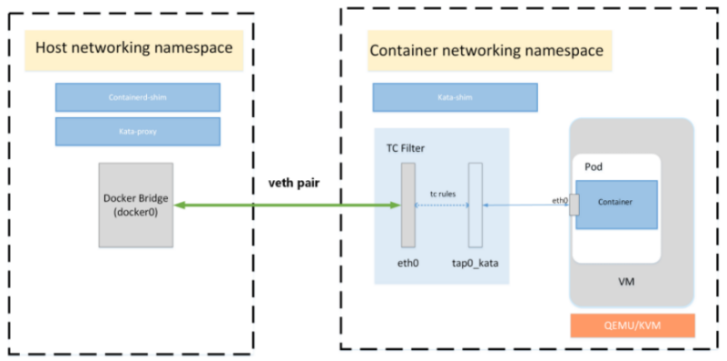
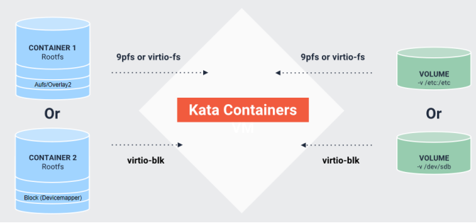
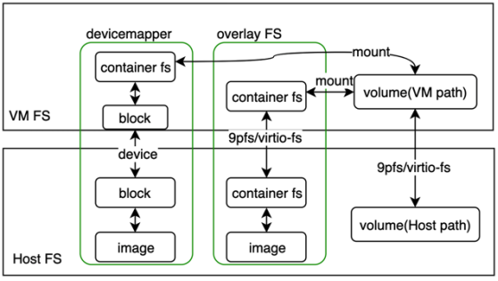

 
[TOC]
# 网络
虚拟机连接容器网络接口的方式：
- macvtap（早期默认）：创建了一个 MACVTAP 设备以直接连接到eth0设备
- none(使用自定义网络，只创建一个 tap 设备，不创建 veth pair)
- tcfilter(通过 tc filter 规则将插件提供的网络接口流量重定向到连接到 VM 的 tap 接口) （现在默认）
- bridge：（已弃用）
```bash
# Internetworking model
# Determines how the VM should be connected to the
# the container network interface
# Options:
#
#   - macvtap
#     Used when the Container network interface can be bridged using
#     macvtap.
#
#   - none
#     Used when customize network. Only creates a tap device. No veth pair.
#
#   - tcfilter
#     Uses tc filter rules to redirect traffic from the network interface
#     provided by plugin to a tap interface connected to the VM.
#
internetworking_model="tcfilter"
```
TC-filter 是默认设置，因为它允许更简单的配置、更好的 CNI 插件兼容性以及与 MACVTAP 相当的性能。




- eth0属于veth-pair类型接口，一端接入cni创建的网络命名空间，一端接入宿主机
- tap0_kata属于tap类型接口，一端接入cni创建的网络命名空间，一端接入qemu创建的hypervisor
- 使用tc策略打通eth0网络接口和tap0_kata网络接口

Sandbox环境中只有eth0网络接口，这个接口是qemu和tap模拟出的接口，mac、ip、掩码都和宿主机中cni创建的网络命名空间中eth0的配置一样

Container运行在Sandbox环境中，Container采用共享宿主机网络命名空间方式创建容器，所以在container中看到的网络配置和Sandbox一样


## 网络流量走向：

​		流量进入宿主机后首先由物理网络通过veth pair接入到net namespace，net namespace中在使用TC filter 规则流量到tap网络接口，然后再通过tap网络接口把流量送入虚拟化环境中，最后虚拟化环境中的容器共享宿主机网络命名空间后就可以在容器中拿到网络流量

```bash
[root@rqy-k8s-1 hff]# ip netns exec cni-c1dea1e8-5df7-f16e-4810-e51d8895ca20 ip a
1: lo: <LOOPBACK,UP,LOWER_UP> mtu 65536 qdisc noqueue state UNKNOWN group default qlen 1000
 link/loopback 00:00:00:00:00:00 brd 00:00:00:00:00:00
 inet 127.0.0.1/8 scope host lo
 valid_lft forever preferred_lft forever
 inet6 ::1/128 scope host
 valid_lft forever preferred_lft forever
2: tunl0@NONE: <NOARP> mtu 1480 qdisc noop state DOWN group default qlen 1000
 link/ipip 0.0.0.0 brd 0.0.0.0
4: eth0@if113: <BROADCAST,MULTICAST,UP,LOWER_UP> mtu 1440 qdisc noqueue state UP group default qlen 1000
 link/ether de:95:a9:f2:89:db brd ff:ff:ff:ff:ff:ff link-netnsid 0
 inet 10.192.181.55/32 scope global eth0
 valid_lft forever preferred_lft forever
 inet6 fe80::dc95:a9ff:fef2:89db/64 scope link
 valid_lft forever preferred_lft forever
5: tap0_kata: <BROADCAST,MULTICAST,UP,LOWER_UP> mtu 1440 qdisc mq state UNKNOWN group default qlen 1000
 link/ether ee:32:c5:ac:30:06 brd ff:ff:ff:ff:ff:ff
 inet6 fe80::ec32:c5ff:feac:3006/64 scope link
 valid_lft forever preferred_lft forever
[root@rqy-k8s-1 hff]# ip netns exec cni-c1dea1e8-5df7-f16e-4810-e51d8895ca20 tc -s qdisc
qdisc noqueue 0: dev lo root refcnt 2
 Sent 0 bytes 0 pkt (dropped 0, overlimits 0 requeues 0)
 backlog 0b 0p requeues 0
qdisc noqueue 0: dev eth0 root refcnt 2
 Sent 0 bytes 0 pkt (dropped 0, overlimits 0 requeues 0)
 backlog 0b 0p requeues 0
qdisc ingress ffff: dev eth0 parent ffff:fff1 ----------------
 Sent 468 bytes 7 pkt (dropped 0, overlimits 0 requeues 0)
 backlog 0b 0p requeues 0
qdisc mq 0: dev tap0_kata root
 Sent 1222 bytes 15 pkt (dropped 0, overlimits 0 requeues 0)
 backlog 0b 0p requeues 0
qdisc pfifo_fast 0: dev tap0_kata parent :1 bands 3 priomap  1 2 2 2 1 2 0 0 1 1 1 1 1 1 1 1
 Sent 1222 bytes 15 pkt (dropped 0, overlimits 0 requeues 0)
 backlog 0b 0p requeues 0
qdisc ingress ffff: dev tap0_kata parent ffff:fff1 ----------------
 Sent 936 bytes 15 pkt (dropped 0, overlimits 0 requeues 0
 backlog 0b 0p requeues 0
[root@rqy-k8s-1 kbuser]# kubectl exec -it hostpath-kata-57477fb8f7-ls6mq sh
/ # ip addr
1: lo: <LOOPBACK,UP,LOWER_UP> mtu 65536 qdisc noqueue qlen 1000
 link/loopback 00:00:00:00:00:00 brd 00:00:00:00:00:00
 inet 127.0.0.1/8 scope host lo
 valid_lft forever preferred_lft forever
 inet6 ::1/128 scope host
 valid_lft forever preferred_lft forever
2: eth0: <BROADCAST,MULTICAST,UP,LOWER_UP> mtu 1440 qdisc fq qlen 1000
 link/ether de:95:a9:f2:89:db brd ff:ff:ff:ff:ff:ff
 inet 10.192.181.55/32 brd 10.192.181.55 scope global eth0
 valid_lft forever preferred_lft forever
 inet6 fe80::dc95:a9ff:fef2:89db/64 scope link
 valid_lft forever preferred_lft forever
```

> calico网络模型网络流向：
-容器流量通过veth pair到达宿主机的网络命名空间上。
-根据容器要访问的IP所在的子网CIDR和主机上的路由规则，找到下一跳要到达的宿主机IP。
-流量到达下一跳的宿主机后，根据当前宿主机上的路由规则，直接到达对端容器的veth pair插在宿主机的一端，最终进入容器。

# 存储
[storage](https://github.com/kata-containers/kata-containers/blob/main/docs/design/architecture/storage.md)

- virtio SCSI（在基于块的图形驱动程序下使用）
- virtio FS（默认）
- Devicemapper（块设备）





从 Kata Containers 的 2.0 版本开始，virtio-fs是默认的文件系统共享机制（后端是virtiofsd守护进程）。

## virtio-9p 和 virtio-fs 文件系统对比

1. virtio-9p 没有针对虚拟化场景提供优化
2. virtio-fs 利用了 hypervisor 和虚拟机处于相同节点的优势
3. DAX 特性，文件内容映射到宿主机的内存窗口，客户机直接访问宿主机的 page cache
   - 减少内存占用，因为客户机 cache 已经被绕过了
4. 相比 virtio-9p，virtio-fs 具有更好的 POSIX 合规性

## virtiofs

- 所有数据都要经过virtiofs，不管是镜像数据还是⽹络存储卷。虚拟机要和宿主机数据 交互，就必须要穿过qemu，virtiofs就是穿过qemu的桥梁，提供共享⽂件机制。
- guest和host数据传输都是通过virtio-fs，包括容器镜像和容器卷，读写权限取决于virtiofsd进程的权限。
- 数据相关的操作最终还是在宿主机上，⽐如镜像层的合并，仍然是containerd的存储层插件snapshotter完成，底层仍然是调⽤了overlayfs⽂件系统


```bash
[root@localhost hff]# ps -ef | grep 55e043c4c5eacba28c8d97a2aa96f76f153c5f9e49a1ad51f1031237002cf774
root     28330     1  0 10:49 ?        00:00:00 /opt/kata/bin/containerd-shim-kata-v2 -namespace k8s.io -address /run/containerd/containerd.sock -publish-binary /usr/bin/containerd -id 55e043c4c5eacba28c8d97a2aa96f76f153c5f9e49a1ad51f1031237002cf774
root     28342 28330  0 10:49 ?        00:00:00 /opt/kata/libexec/kata-qemu/virtiofsd --syslog -o cache=auto -o no_posix_lock -o source=/run/kata-containers/shared/sandboxes/55e043c4c5eacba28c8d97a2aa96f76f153c5f9e49a1ad51f1031237002cf774/shared --fd=3 -f --thread-pool-size=1 -o announce_submounts
root     28348     1  0 10:49 ?        00:00:00 /opt/kata/bin/qemu-system-x86_64 -name sandbox-55e043c4c5eacba28c8d97a2aa96f76f153c5f9e49a1ad51f1031237002cf774 -uuid 27f404fa-1887-4529-bbbb-df1525845c98 -machine q35,accel=kvm,kernel_irqchip=on,nvdimm=on -cpu host,pmu=off -qmp unix:/run/vc/vm/55e043c4c5eacba28c8d97a2aa96f76f153c5f9e49a1ad51f1031237002cf774/qmp.sock,server=on,wait=off -m 2048M,slots=10,maxmem=8773M -device pci-bridge,bus=pcie.0,id=pci-bridge-0,chassis_nr=1,shpc=off,addr=2,io-reserve=4k,mem-reserve=1m,pref64-reserve=1m -device virtio-serial-pci,disable-modern=false,id=serial0 -device virtconsole,chardev=charconsole0,id=console0 -chardev socket,id=charconsole0,path=/run/vc/vm/55e043c4c5eacba28c8d97a2aa96f76f153c5f9e49a1ad51f1031237002cf774/console.sock,server=on,wait=off -device nvdimm,id=nv0,memdev=mem0,unarmed=on -object memory-backend-file,id=mem0,mem-path=/opt/kata/share/kata-containers/kata-clearlinux-latest.image,size=134217728,readonly=on -device virtio-scsi-pci,id=scsi0,disable-modern=false -object rng-random,id=rng0,filename=/dev/urandom -device virtio-rng-pci,rng=rng0 -device vhost-vsock-pci,disable-modern=false,vhostfd=3,id=vsock-3099871275,guest-cid=3099871275 -chardev socket,id=char-3352582b4396a8ee,path=/run/vc/vm/55e043c4c5eacba28c8d97a2aa96f76f153c5f9e49a1ad51f1031237002cf774/vhost-fs.sock -device vhost-user-fs-pci,chardev=char-3352582b4396a8ee,tag=kataShared -netdev tap,id=network-0,vhost=on,vhostfds=4,fds=5 -device driver=virtio-net-pci,netdev=network-0,mac=7e:c7:e5:c6:8c:d7,disable-modern=false,mq=on,vectors=4 -rtc base=utc,driftfix=slew,clock=host -global kvm-pit.lost_tick_policy=discard -vga none -no-user-config -nodefaults -nographic --no-reboot -daemonize -object memory-backend-file,id=dimm1,size=2048M,mem-path=/dev/shm,share=on -numa node,memdev=dimm1 -kernel /opt/kata/share/kata-containers/vmlinux-5.15.26-90 -append tsc=reliable no_timer_check rcupdate.rcu_expedited=1 i8042.direct=1 i8042.dumbkbd=1 i8042.nopnp=1 i8042.noaux=1 noreplace-smp reboot=k console=hvc0 console=hvc1 cryptomgr.notests net.ifnames=0 pci=lastbus=0 root=/dev/pmem0p1 rootflags=dax,data=ordered,errors=remount-ro ro rootfstype=ext4 quiet systemd.show_status=false panic=1 nr_cpus=8 systemd.unit=kata-containers.target systemd.mask=systemd-networkd.service systemd.mask=systemd-networkd.socket scsi_mod.scan=none -pidfile /run/vc/vm/55e043c4c5eacba28c8d97a2aa96f76f153c5f9e49a1ad51f1031237002cf774/pid -smp 1,cores=1,threads=1,sockets=8,maxcpus=8
root     28355 28342  0 10:49 ?        00:00:00 /opt/kata/libexec/kata-qemu/virtiofsd --syslog -o cache=auto -o no_posix_lock -o source=/run/kata-containers/shared/sandboxes/55e043c4c5eacba28c8d97a2aa96f76f153c5f9e49a1ad51f1031237002cf774/shared --fd=3 -f --thread-pool-size=1 -o announce_submounts
```

每⼀个 virtiofsd进程的fd参数都等于3，因为⽂件描述符是进程独⽴的，STDIO占 据了0，1和2，那么virtiofsd第⼀个可⽤的fd num就是3了 

# 存储配置
## 存储路径：
/run/kata-containers/shared/sandboxes/
/run/vc/vm/
/run/vc/sbs/

```bash
[root@localhost ~]# find / -name hfftest0413-etc
/run/kata-containers/shared/sandboxes/3b54b3b02fc7f6905d01aedfc4eb209cfb11fd9136006ed6e11e1e26c0f48562/mounts/c7c33d3c7666933c6f1c182bb49bf850c5ca99f08b4595b0f37e6f817bb52768/rootfs/etc/hfftest0413-etc
/run/kata-containers/shared/sandboxes/3b54b3b02fc7f6905d01aedfc4eb209cfb11fd9136006ed6e11e1e26c0f48562/shared/c7c33d3c7666933c6f1c182bb49bf850c5ca99f08b4595b0f37e6f817bb52768/rootfs/etc/hfftest0413-etc
/run/containerd/io.containerd.runtime.v2.task/k8s.io/c7c33d3c7666933c6f1c182bb49bf850c5ca99f08b4595b0f37e6f817bb52768/rootfs/etc/hfftest0413-etc
/var/lib/containerd/io.containerd.snapshotter.v1.overlayfs/snapshots/199015/fs/etc/hfftest0413-etc
```


### virtiofsd cache
guest 生成时会指定内存大小，virtiofsd 会共享使用 guest 的内存。默认使用memory-backend-file 内存对象。

guest 和 host 数据传输都是通过 virtio-fs，包括容器镜像和容器卷，读写权限取决于 virtiofsd 进程的权限。


### DAX(直接访问)
DAX windows 是一块虚拟内存区域，通过 PCI Bar 把文件映射到 guest 里面，并不真正的占用主机那么多内存，即使有 100 个虚拟机，设置的 DAX cache 是 1G，也不会真的使用 100G 内存。

如果没有 DAX，内存使⽤量可能会⾮常⼤，因为每个 guest都有⾃⼰的⽂件缓冲区。 

Kata Containers 官方下载的版本默认没有支持，需要编译安装 gitlab 托管的 virtio-fs qemu 项目 qemu5.0-virtiofs-dax 分支，需要单独编译qemu?qemu5.0-virtiofs-dax????

- configuration.toml 设置virtio_fs_cache_size dax window ⼤⼩ 


### virtiofsd已知问题汇总

[https://github.com/kata-containers/runtime/issues/2797](https://github.com/kata-containers/runtime/issues/2797)

## containerd的Snapshotter

Snapshot为containerd实现了Snapshotter用于管理文件系统上容器镜像的快照和容器的rootfs挂载和卸载等操作功能。 snapshotter对标Docker中的graphdriver存储驱动的设计。

[https://blog.mobyproject.org/where-are-containerds-graph-drivers-145fc9b7255](https://blog.mobyproject.org/where-are-containerds-graph-drivers-145fc9b7255)
# 参考资料
[https://blog.csdn.net/u010827484/article/details/117488338](https://blog.csdn.net/u010827484/article/details/117488338)
[https://github.com/kata-containers/kata-containers/blob/main/docs/design/architecture/networking.md](https://github.com/kata-containers/kata-containers/blob/main/docs/design/architecture/networking.md)
[http://miaoyq.com/kata-containers-share/](http://miaoyq.com/kata-containers-share/)