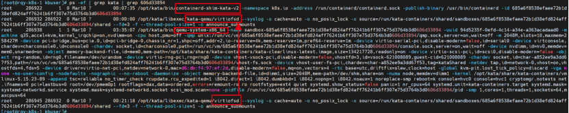
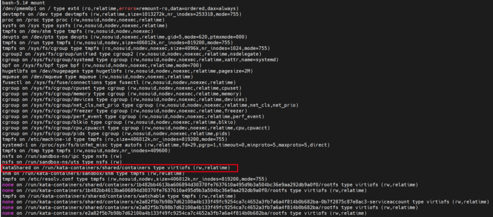

[TOC]

# 环境
>k8s: 1.17.2
containerd: 1.4.6
kata: 2.4.0

# 创建一个kata容器
```yaml
    resources:
      limits:
        cpu: "1"
        memory: 1Gi
      requests:
        cpu: "1"
        memory: 1Gi

```
```bash
[root@localhost ~]# kubectl get pod -o wide
NAME                              READY   STATUS    RESTARTS   AGE   IP               NODE                    NOMINATED NODE   READINESS GATES
test-runc                         1/1     Running   0          19h   10.241.102.169   localhost.localdomain   <none>           <none>
[root@localhost ~]# kubectl top pod
NAME                              CPU(cores)   MEMORY(bytes)
test-kata                         0m           2Mi
[root@localhost ~]# kubectl describe node | grep kata
  default                     test-kata                                                1250m (16%)   1250m (16%)  1184Mi (18%)     1184Mi (18%)   64m
```
## crictl pods
```bash
[root@localhost ~]# crictl pods
POD ID              CREATED             STATE               NAME                                                    NAMESPACE              ATTEMPT             RUNTIME
3871d0c8108c6       About an hour ago   Ready               test-kata                                               default                0                   kata-qemu
```
## crictl ps
```bash
[root@localhost ~]# crictl ps
CONTAINER           IMAGE               CREATED             STATE               NAME                                   ATTEMPT             POD ID
a83ce7bc82f78       e39e5c33c2d50       About an hour ago   Running             pod1                                   0                   3871d0c8108c6

```
## crictl stats
```bash
[root@localhost ~]# crictl stats a83ce7bc82f78
CONTAINER           CPU %               MEM                 DISK                INODES
a83ce7bc82f78       0.00                3.056MB             16.38kB             14

```
## 获取sandboxID
```bash
[root@localhost ~]# crictl inspect a83ce7bc82f78 | grep sandboxID
    "sandboxID": "3871d0c8108c66d3388f883f0d4de0cdf3e724607a06bce653fc13a988cd1985",
```
## 宿主机进程

```bash
[root@localhost ~]# ps -ef | grep 3871d0c8108c66d3388f883f0d4de0cdf3e724607a06bce653fc13a988cd1985
root      2251   429  0 11:32 pts/2    00:00:00 grep --color=auto 3871d0c8108c66d3388f883f0d4de0cdf3e724607a06bce653fc13a988cd1985
root     23520     1  0 10:24 ?        00:00:01 /opt/kata/bin/containerd-shim-kata-v2 -namespace k8s.io -address /run/containerd/containerd.sock -publish-binary /usr/bin/containerd -id 3871d0c8108c66d3388f883f0d4de0cdf3e724607a06bce653fc13a988cd1985
root     23528 23520  0 10:24 ?        00:00:00 /opt/kata/libexec/kata-qemu/virtiofsd --syslog -o cache=auto -o no_posix_lock -o source=/run/kata-containers/shared/sandboxes/3871d0c8108c66d3388f883f0d4de0cdf3e724607a06bce653fc13a988cd1985/shared --fd=3 -f --thread-pool-size=1 -o announce_submounts
root     23535     1  0 10:24 ?        00:00:09 /opt/kata/bin/qemu-system-x86_64 -name sandbox-3871d0c8108c66d3388f883f0d4de0cdf3e724607a06bce653fc13a988cd1985 -uuid 2cfc6a6d-63ab-41aa-ac4b-18cb10377791 -machine q35,accel=kvm,kernel_irqchip=on,nvdimm=on -cpu host,pmu=off -qmp unix:/run/vc/vm/3871d0c8108c66d3388f883f0d4de0cdf3e724607a06bce653fc13a988cd1985/qmp.sock,server=on,wait=off -m 2048M,slots=10,maxmem=8773M -device pci-bridge,bus=pcie.0,id=pci-bridge-0,chassis_nr=1,shpc=off,addr=2,io-reserve=4k,mem-reserve=1m,pref64-reserve=1m -device virtio-serial-pci,disable-modern=false,id=serial0 -device virtconsole,chardev=charconsole0,id=console0 -chardev socket,id=charconsole0,path=/run/vc/vm/3871d0c8108c66d3388f883f0d4de0cdf3e724607a06bce653fc13a988cd1985/console.sock,server=on,wait=off -device nvdimm,id=nv0,memdev=mem0,unarmed=on -object memory-backend-file,id=mem0,mem-path=/opt/kata/share/kata-containers/kata-clearlinux-latest.image,size=134217728,readonly=on -device virtio-scsi-pci,id=scsi0,disable-modern=false -object rng-random,id=rng0,filename=/dev/urandom -device virtio-rng-pci,rng=rng0 -device vhost-vsock-pci,disable-modern=false,vhostfd=3,id=vsock-4001198526,guest-cid=4001198526 -chardev socket,id=char-93f9924bc919f096,path=/run/vc/vm/3871d0c8108c66d3388f883f0d4de0cdf3e724607a06bce653fc13a988cd1985/vhost-fs.sock -device vhost-user-fs-pci,chardev=char-93f9924bc919f096,tag=kataShared -netdev tap,id=network-0,vhost=on,vhostfds=4,fds=5 -device driver=virtio-net-pci,netdev=network-0,mac=ea:e4:96:23:5e:9f,disable-modern=false,mq=on,vectors=4 -rtc base=utc,driftfix=slew,clock=host -global kvm-pit.lost_tick_policy=discard -vga none -no-user-config -nodefaults -nographic --no-reboot -daemonize -object memory-backend-file,id=dimm1,size=2048M,mem-path=/dev/shm,share=on -numa node,memdev=dimm1 -kernel /opt/kata/share/kata-containers/vmlinux-5.15.26-90 -append tsc=reliable no_timer_check rcupdate.rcu_expedited=1 i8042.direct=1 i8042.dumbkbd=1 i8042.nopnp=1 i8042.noaux=1 noreplace-smp reboot=k console=hvc0 console=hvc1 cryptomgr.notests net.ifnames=0 pci=lastbus=0 root=/dev/pmem0p1 rootflags=dax,data=ordered,errors=remount-ro ro rootfstype=ext4 quiet systemd.show_status=false panic=1 nr_cpus=8 systemd.unit=kata-containers.target systemd.mask=systemd-networkd.service systemd.mask=systemd-networkd.socket scsi_mod.scan=none agent.debug_console agent.debug_console_vport=1026 -pidfile /run/vc/vm/3871d0c8108c66d3388f883f0d4de0cdf3e724607a06bce653fc13a988cd1985/pid -smp 1,cores=1,threads=1,sockets=8,maxcpus=8
root     23543 23528  0 10:24 ?        00:00:01 /opt/kata/libexec/kata-qemu/virtiofsd --syslog -o cache=auto -o no_posix_lock -o source=/run/kata-containers/shared/sandboxes/3871d0c8108c66d3388f883f0d4de0cdf3e724607a06bce653fc13a988cd1985/shared --fd=3 -f --thread-pool-size=1 -o announce_submounts
root     27463 17898  0 10:26 pts/0    00:00:00 kata-runtime exec 3871d0c8108c66d3388f883f0d4de0cdf3e724607a06bce653fc13a988cd1985
```


## ip netns
```bash
[root@localhost ~]# ip netns exec cni-75b072ca-fd5a-ceda-617d-9ce0b606ac5e  ip a
1: lo: <LOOPBACK,UP,LOWER_UP> mtu 65536 qdisc noqueue state UNKNOWN group default qlen 1000
    link/loopback 00:00:00:00:00:00 brd 00:00:00:00:00:00
    inet 127.0.0.1/8 scope host lo
       valid_lft forever preferred_lft forever
    inet6 ::1/128 scope host
       valid_lft forever preferred_lft forever
2: tunl0@NONE: <NOARP> mtu 1480 qdisc noop state DOWN group default qlen 1000
    link/ipip 0.0.0.0 brd 0.0.0.0
4: eth0@if17552: <BROADCAST,MULTICAST,UP,LOWER_UP> mtu 1440 qdisc noqueue state UP group default qlen 1000
    link/ether ea:e4:96:23:5e:9f brd ff:ff:ff:ff:ff:ff link-netnsid 0
    inet 10.241.103.177/32 scope global eth0
       valid_lft forever preferred_lft forever
    inet6 fe80::e8e4:96ff:fe23:5e9f/64 scope link
       valid_lft forever preferred_lft forever
5: tap0_kata: <BROADCAST,MULTICAST,UP,LOWER_UP> mtu 1440 qdisc mq state UNKNOWN group default qlen 1000
    link/ether a2:a5:96:5b:90:23 brd ff:ff:ff:ff:ff:ff
    inet6 fe80::a0a5:96ff:fe5b:9023/64 scope link
       valid_lft forever preferred_lft forever
[root@localhost ~]# ip netns exec cni-75b072ca-fd5a-ceda-617d-9ce0b606ac5e  tc -s qdisc
qdisc noqueue 0: dev lo root refcnt 2
 Sent 0 bytes 0 pkt (dropped 0, overlimits 0 requeues 0)
 backlog 0b 0p requeues 0
qdisc noqueue 0: dev eth0 root refcnt 2
 Sent 0 bytes 0 pkt (dropped 0, overlimits 0 requeues 0)
 backlog 0b 0p requeues 0
qdisc ingress ffff: dev eth0 parent ffff:fff1 ----------------
 Sent 468 bytes 7 pkt (dropped 0, overlimits 0 requeues 0)
 backlog 0b 0p requeues 0
qdisc mq 0: dev tap0_kata root
 Sent 1222 bytes 15 pkt (dropped 0, overlimits 0 requeues 0)
 backlog 0b 0p requeues 0
qdisc pfifo_fast 0: dev tap0_kata parent :1 bands 3 priomap  1 2 2 2 1 2 0 0 1 1 1 1 1 1 1 1
 Sent 1222 bytes 15 pkt (dropped 0, overlimits 0 requeues 0)
 backlog 0b 0p requeues 0
qdisc ingress ffff: dev tap0_kata parent ffff:fff1 ----------------
 Sent 992 bytes 16 pkt (dropped 0, overlimits 0 requeues 0)
 backlog 0b 0p requeues 0

```

## 宿主机目录
>/run/kata-containers/shared/sandboxes/
>/run/vc/vm/
>/run/vc/sbs/
>/sys/fs/cgroup/(memory、devices、cpu,cpuacct...)
>/sys/fs/cgroup/systemd/kata_overhead/
>/app/docker/containerd/


## vm_pid

```bash
[root@localhost ~]# cat /proc/23535/status
Name:   qemu-system-x86
Umask:  0027
State:  S (sleeping)
Tgid:   23535
Ngid:   0
Pid:    23535
PPid:   1
TracerPid:      0
Uid:    0       0       0       0
Gid:    0       0       0       0
FDSize: 128
Groups:
VmPeak:  3659100 kB
VmSize:  3659100 kB
VmLck:         0 kB
VmPin:         0 kB
VmHWM:    152104 kB
VmRSS:    152104 kB
RssAnon:           14288 kB
RssFile:           35956 kB
RssShmem:         101860 kB
VmData:   326316 kB
VmStk:       132 kB
VmExe:      8496 kB
VmLib:         0 kB
VmPTE:       652 kB
VmSwap:        0 kB
Threads:        5
SigQ:   0/30632
SigPnd: 0000000000000000
ShdPnd: 0000000000000000
SigBlk: 0000000010002240
SigIgn: 0000000000381000
SigCgt: 0000000180004243
CapInh: 0000000000000000
CapPrm: 0000001fffffffff
CapEff: 0000001fffffffff
CapBnd: 0000001fffffffff
CapAmb: 0000000000000000
NoNewPrivs:     0
Seccomp:        0
Speculation_Store_Bypass:       thread vulnerable
Cpus_allowed:   ff
Cpus_allowed_list:      0-7
Mems_allowed:   00000000,00000000,00000000,00000000,00000000,00000000,00000000,00000000,00000000,00000000,00000000,00000000,00000000,00000000,00000000,00000000,00000000,00000000,00000000,00000000,00000000,00000000,00000000,00000000,00000000,00000000,00000000,00000000,00000000,00000000,00000000,00000001
Mems_allowed_list:      0
voluntary_ctxt_switches:        1769
nonvoluntary_ctxt_switches:     4
```

# 进入kata容器

## df -h
```bash

root@hostpath-kata-7949f86f8c-8gfqj:/# df -h

Filesystem      Size  Used Avail Use% Mounted on

none            494G   28G  466G   6% /

tmpfs            64M     0   64M   0% /dev

tmpfs           992M     0  992M   0% /sys/fs/cgroup

none            494G   28G  466G   6% /hff

kataShared      494G   28G  466G   6% /etc/hosts

shm             992M     0  992M   0% /dev/shm

tmpfs           992M   12K  992M   1% /run/secrets/kubernetes.io/serviceaccount
```
## lsblk
```bash

root@hostpath-kata-7949f86f8c-8gfqj:/# lsblk

NAME      MAJ:MIN RM  SIZE RO TYPE MOUNTPOINT

pmem0     259:0    0  126M  1 disk

`-pmem0p1 259:1    0  124M  1 part
```
## ip addr
```bash
/ # ip addr
root@test-kata:/# ip a
1: lo: <LOOPBACK,UP,LOWER_UP> mtu 65536 qdisc noqueue state UNKNOWN group default qlen 1000
    link/loopback 00:00:00:00:00:00 brd 00:00:00:00:00:00
    inet 127.0.0.1/8 scope host lo
       valid_lft forever preferred_lft forever
    inet6 ::1/128 scope host
       valid_lft forever preferred_lft forever
2: eth0: <BROADCAST,MULTICAST,UP,LOWER_UP> mtu 1440 qdisc fq state UP group default qlen 1000
    link/ether ea:e4:96:23:5e:9f brd ff:ff:ff:ff:ff:ff
    inet 10.241.103.177/32 brd 10.241.103.177 scope global eth0
       valid_lft forever preferred_lft forever
    inet6 fe80::e8e4:96ff:fe23:5e9f/64 scope link
       valid_lft forever preferred_lft forever

```


## mount
```bash
root@test-kata:/# mount
none on / type virtiofs (rw,relatime)
proc on /proc type proc (rw,nosuid,nodev,noexec,relatime)
tmpfs on /dev type tmpfs (rw,nosuid,size=65536k,nr_inodes=255223,mode=755)
devpts on /dev/pts type devpts (rw,nosuid,noexec,relatime,gid=5,mode=620,ptmxmode=666)
mqueue on /dev/mqueue type mqueue (rw,nosuid,nodev,noexec,relatime)
sysfs on /sys type sysfs (ro,nosuid,nodev,noexec,relatime)
tmpfs on /sys/fs/cgroup type tmpfs (ro,nosuid,nodev,noexec,relatime,size=1020892k,nr_inodes=255223)
cgroup on /sys/fs/cgroup/systemd type cgroup (rw,nosuid,nodev,noexec,relatime,xattr,name=systemd)
cgroup on /sys/fs/cgroup/memory type cgroup (ro,nosuid,nodev,noexec,relatime,memory)
cgroup on /sys/fs/cgroup/devices type cgroup (ro,nosuid,nodev,noexec,relatime,devices)
cgroup on /sys/fs/cgroup/cpuset type cgroup (ro,nosuid,nodev,noexec,relatime,cpuset)
cgroup on /sys/fs/cgroup/pids type cgroup (ro,nosuid,nodev,noexec,relatime,pids)
cgroup on /sys/fs/cgroup/net_cls,net_prio type cgroup (ro,nosuid,nodev,noexec,relatime,net_cls,net_prio)
cgroup on /sys/fs/cgroup/perf_event type cgroup (ro,nosuid,nodev,noexec,relatime,perf_event)
cgroup on /sys/fs/cgroup/cpu,cpuacct type cgroup (ro,nosuid,nodev,noexec,relatime,cpu,cpuacct)
cgroup on /sys/fs/cgroup/blkio type cgroup (ro,nosuid,nodev,noexec,relatime,blkio)
cgroup on /sys/fs/cgroup/freezer type cgroup (ro,nosuid,nodev,noexec,relatime,freezer)
none on /test type virtiofs (rw,relatime)
kataShared on /etc/hosts type virtiofs (rw,relatime)
kataShared on /dev/termination-log type virtiofs (rw,relatime)
kataShared on /etc/hostname type virtiofs (rw,relatime)
kataShared on /etc/resolv.conf type virtiofs (rw,relatime)
shm on /dev/shm type tmpfs (rw,relatime,size=1020892k,nr_inodes=255223)
tmpfs on /run/secrets/kubernetes.io/serviceaccount type tmpfs (ro,relatime,size=1020892k,nr_inodes=255223)
tmpfs on /proc/timer_list type tmpfs (rw,nosuid,size=65536k,nr_inodes=255223,mode=755)
proc on /proc/bus type proc (ro,relatime)
proc on /proc/fs type proc (ro,relatime)
proc on /proc/irq type proc (ro,relatime)
proc on /proc/sys type proc (ro,relatime)

```


# 进入kata vm 
https://github.com/kata-containers/kata-containers/issues/2010
```bash
[root@rqy-k8s-1 kbuser]# kata-runtime exec 1b482bb4613ba606894d30370fe7637610a495d9b3a504bc36e9aa292db9a0f0
bash: grep: command not found
bash: grep: command not found
bash: tty: command not found
bash: expr: command not found
bash: [: : integer expression expected
bash-5.1#
bash-5.1#
```
## lsblk
```bash
bash-5.1# lsblk
NAME      MAJ:MIN RM  SIZE RO TYPE MOUNTPOINTS
pmem0     259:0    0  126M  1 disk
`-pmem0p1 259:1    0  124M  1 part /
bash-5.1#
```
## 看看挂载了什么分区

```bash
bash-5.1# mount
/dev/pmem0p1 on / type ext4 (ro,relatime,errors=remount-ro,data=ordered,dax=always)
devtmpfs on /dev type devtmpfs (rw,relatime,size=1019140k,nr_inodes=254785,mode=755)
proc on /proc type proc (rw,nosuid,nodev,noexec,relatime)
sysfs on /sys type sysfs (rw,nosuid,nodev,noexec,relatime)
tmpfs on /dev/shm type tmpfs (rw,nosuid,nodev,noexec,size=1020892k,nr_inodes=255223)
devpts on /dev/pts type devpts (rw,nosuid,noexec,relatime,gid=5,mode=620,ptmxmode=000)
tmpfs on /run type tmpfs (rw,nosuid,nodev,size=408360k,nr_inodes=819200,mode=755)
tmpfs on /sys/fs/cgroup type tmpfs (ro,nosuid,nodev,noexec,size=4096k,nr_inodes=1024,mode=755)
cgroup2 on /sys/fs/cgroup/unified type cgroup2 (rw,nosuid,nodev,noexec,relatime,nsdelegate)
cgroup on /sys/fs/cgroup/systemd type cgroup (rw,nosuid,nodev,noexec,relatime,xattr,name=systemd)
bpf on /sys/fs/bpf type bpf (rw,nosuid,nodev,noexec,relatime,mode=700)
hugetlbfs on /dev/hugepages type hugetlbfs (rw,nosuid,nodev,noexec,relatime,pagesize=2M)
mqueue on /dev/mqueue type mqueue (rw,nosuid,nodev,noexec,relatime)
fusectl on /sys/fs/fuse/connections type fusectl (rw,nosuid,nodev,noexec,relatime)
cgroup on /sys/fs/cgroup/blkio type cgroup (rw,nosuid,nodev,noexec,relatime,blkio)
cgroup on /sys/fs/cgroup/memory type cgroup (rw,nosuid,nodev,noexec,relatime,memory)
cgroup on /sys/fs/cgroup/freezer type cgroup (rw,nosuid,nodev,noexec,relatime,freezer)
cgroup on /sys/fs/cgroup/cpuset type cgroup (rw,nosuid,nodev,noexec,relatime,cpuset)
cgroup on /sys/fs/cgroup/cpu,cpuacct type cgroup (rw,nosuid,nodev,noexec,relatime,cpu,cpuacct)
cgroup on /sys/fs/cgroup/pids type cgroup (rw,nosuid,nodev,noexec,relatime,pids)
cgroup on /sys/fs/cgroup/net_cls,net_prio type cgroup (rw,nosuid,nodev,noexec,relatime,net_cls,net_prio)
cgroup on /sys/fs/cgroup/devices type cgroup (rw,nosuid,nodev,noexec,relatime,devices)
cgroup on /sys/fs/cgroup/perf_event type cgroup (rw,nosuid,nodev,noexec,relatime,perf_event)
tmpfs on /etc/machine-id type tmpfs (ro,size=408360k,nr_inodes=819200,mode=755)
systemd-1 on /proc/sys/fs/binfmt_misc type autofs (rw,relatime,fd=29,pgrp=1,timeout=0,minproto=5,maxproto=5,direct)
tmpfs on /tmp type tmpfs (rw,nosuid,nodev,size=1020896k,nr_inodes=1048576)
nsfs on /run/sandbox-ns/ipc type nsfs (rw)
nsfs on /run/sandbox-ns/uts type nsfs (rw)
kataShared on /run/kata-containers/shared/containers type virtiofs (rw,relatime)
shm on /run/kata-containers/sandbox/shm type tmpfs (rw,relatime,size=1020892k,nr_inodes=255223)
tmpfs on /etc/resolv.conf type tmpfs (rw,nosuid,nodev,size=408360k,nr_inodes=819200,mode=755)
none on /run/kata-containers/shared/containers/3871d0c8108c66d3388f883f0d4de0cdf3e724607a06bce653fc13a988cd1985/rootfs type virtiofs (rw,relatime)
none on /run/kata-containers/3871d0c8108c66d3388f883f0d4de0cdf3e724607a06bce653fc13a988cd1985/rootfs type virtiofs (rw,relatime)
tmpfs on /run/kata-containers/shared/containers/watchable type tmpfs (rw,relatime,size=1020892k,nr_inodes=255223)
none on /run/kata-containers/shared/containers/a83ce7bc82f78808ff1aa8165e705ecded65634ba54a57a1eda68c19d751f98a-172195b99cf7a9fd-serviceaccount type virtiofs (rw,relatime)
none on /run/kata-containers/shared/containers/a83ce7bc82f78808ff1aa8165e705ecded65634ba54a57a1eda68c19d751f98a/rootfs type virtiofs (rw,relatime)
none on /run/kata-containers/a83ce7bc82f78808ff1aa8165e705ecded65634ba54a57a1eda68c19d751f98a/rootfs type virtiofs (rw,relatime)

```

## ls都没有，只能echo * 代替。
```bash
bash-5.1# echo *
autofs bin boot dev etc home lib lib64 lost+found media mnt proc root run sbin srv sys tmp usr var
```

## uname -a

## 看看激活了什么内核模块
```bash
bash-5.1# lsmod
libkmod: kmod_module_new_from_loaded: could not open /proc/modules: No such file or directory
Error: could not get list of modules: No such file or directory
```

## 看看都有什么进程
bash-5.1# ps efx ww

## 看看有多少内存
bash-5.1# free -h

## 看看内核启动参数
bash-5.1#  cat cmdline

## 看看systemctl的服务
```bash
bash-5.1# systemctl list-units
  UNIT                                                                                                                                                  LOAD   ACTIVE     SUB       DESCRIPTION          
  proc-sys-fs-binfmt_misc.automount                                                                                                                     loaded active     waiting   Arbitrary Executable File Formats File System Automount Point
  dev-pmem0p1.device                                                                                                                                    loaded activating tentative /dev/pmem0p1         
  -.mount                                                                                                                                               loaded active     mounted   Root Mount
  etc-machine\x2did.mount                                                                                                                               loaded active     mounted   /etc/machine-id
  etc-resolv.conf.mount                                                                                                                                 loaded active     mounted   /etc/resolv.conf
  run-kata\x2dcontainers-3871d0c8108c66d3388f883f0d4de0cdf3e724607a06bce653fc13a988cd1985-rootfs.mount                                                  loaded active     mounted   /run/kata-containers/3871d0c8108c66d3388f883f0d4de0cdf3e724607a06bce653fc13a988cd1985/rootfs
  run-kata\x2dcontainers-a83ce7bc82f78808ff1aa8165e705ecded65634ba54a57a1eda68c19d751f98a-rootfs.mount                                                  loaded active     mounted   /run/kata-containers/a83ce7bc82f78808ff1aa8165e705ecded65634ba54a57a1eda68c19d751f98a/rootfs
  run-kata\x2dcontainers-sandbox-shm.mount                                                                                                              loaded active     mounted   /run/kata-containers/sandbox/shm
  run-kata\x2dcontainers-shared-containers-3871d0c8108c66d3388f883f0d4de0cdf3e724607a06bce653fc13a988cd1985-rootfs.mount                                loaded active     mounted   /run/kata-containers/shared/containers/3871d0c8108c66d3388f883f0d4de0cdf3e724607a06bce653fc13a988cd1985/rootfs
  run-kata\x2dcontainers-shared-containers-a83ce7bc82f78808ff1aa8165e705ecded65634ba54a57a1eda68c19d751f98a-rootfs.mount                                loaded active     mounted   /run/kata-containers/shared/containers/a83ce7bc82f78808ff1aa8165e705ecded65634ba54a57a1eda68c19d751f98a/rootfs
  run-kata\x2dcontainers-shared-containers-a83ce7bc82f78808ff1aa8165e705ecded65634ba54a57a1eda68c19d751f98a\x2d172195b99cf7a9fd\x2dserviceaccount.mount loaded active     mounted   /run/kata-containers/shared/containers/a83ce7bc82f78808ff1aa8165e705ecded65634ba54a57a1eda68c19d751f98a-172195b99cf7a9fd-serviceaccount
  run-kata\x2dcontainers-shared-containers-watchable.mount                                                                                              loaded active     mounted   /run/kata-containers/shared/containers/watchable
  run-kata\x2dcontainers-shared-containers.mount                                                                                                        loaded active     mounted   /run/kata-containers/shared/containers
  run-sandbox\x2dns-ipc.mount                                                                                                                           loaded active     mounted   /run/sandbox-ns/ipc
  run-sandbox\x2dns-uts.mount                                                                                                                           loaded active     mounted   /run/sandbox-ns/uts
  tmp.mount                                                                                                                                             loaded active     mounted   Temporary Directory /tmp
  systemd-ask-password-console.path                                                                                                                     loaded active     waiting   Dispatch Password Requests to Console Directory Watch
  init.scope                                                                                                                                            loaded active     running   System and Service Manager
● chronyd.service                                                                                                                                       loaded failed     failed    NTP client/server
  kata-agent.service                                                                                                                                    loaded active     running   Kata Containers Agent
  systemd-remount-fs.service                                                                                                                            loaded active     exited    Remount Root and Kernel File Systems
  systemd-sysctl.service                                                                                                                                loaded active     exited    Apply Kernel Variables
  -.slice                                                                                                                                               loaded active     active    Root Slice
  system.slice                                                                                                                                          loaded active     active    System Slice         
  systemd-coredump.socket                                                                                                                               loaded active     listening Process Core Dump Socket
  basic.target                                                                                                                                          loaded active     active    Basic System
  cryptsetup.target                                                                                                                                     loaded active     active    Local Encrypted Volumes
  kata-containers.target                                                                                                                                loaded active     active    Kata Containers Agent Target
  local-fs-pre.target                                                                                                                                   loaded active     active    Preparation for Local File Systems
  local-fs.target                                                                                                                                       loaded active     active    Local File Systems
  paths.target                                                                                                                                          loaded active     active    Path Units
  slices.target                                                                                                                                         loaded active     active    Slice Units
  sockets.target                                                                                                                                        loaded active     active    Socket Units
  swap.target                                                                                                                                           loaded active     active    Swaps
  sysinit.target                                                                                                                                        loaded active     active    System Initialization
  timers.target                                                                                                                                         loaded active     active    Timer Units          
  systemd-tmpfiles-clean.timer                                                                                                                          loaded active     waiting   Daily Cleanup of Temporary Directories

LOAD   = Reflects whether the unit definition was properly loaded.
ACTIVE = The high-level unit activation state, i.e. generalization of SUB.
SUB    = The low-level unit activation state, values depend on unit type.
37 loaded units listed. Pass --all to see loaded but inactive units, too.
To show all installed unit files use 'systemctl list-unit-files'.
```

```bash
bash-5.1#   systemctl cat kata-containers.target
# /usr/lib/systemd/system/kata-containers.target
#
# Copyright (c) 2018-2019 Intel Corporation
#
# SPDX-License-Identifier: Apache-2.0
#

[Unit]
Description=Kata Containers Agent Target
Requires=basic.target
Requires=tmp.mount
Wants=chronyd.service
Requires=kata-agent.service
Conflicts=rescue.service rescue.target
After=basic.target rescue.service rescue.target
AllowIsolate=yes
```


## cpuinfo/meminfo  (2C)
```bash
bash-5.1# more /proc/cpuinfo
processor       : 0
vendor_id       : GenuineIntel
cpu family      : 6
model           : 158
model name      : Intel(R) Core(TM) i7-7700 CPU @ 3.60GHz
stepping        : 9
microcode       : 0xea
cpu MHz         : 3599.982
cache size      : 16384 KB
physical id     : 0
siblings        : 1
core id         : 0
cpu cores       : 1
apicid          : 0
initial apicid  : 0
fpu             : yes
fpu_exception   : yes
cpuid level     : 13
wp              : yes
flags           : fpu vme de pse tsc msr pae mce cx8 apic sep mtrr pge mca cmov pat pse36 clflush mmx fxsr sse sse2 ss syscall nx pdpe1gb rdtscp lm constant_tsc rep_good nopl xtopology cpuid tsc_known_ arat md_clearinvpcid rtm mpx rdseed adx smap clflushopt xsaveopt xsavec xgetbv1--More--e_timer aes xsave avx f16c rdra--More--
iority tsc_offset vtpr mtf vapic ept vpid unrestricted_guest pmld ept_1gb flexpr--More--
swapgs taa itlb_multihit srbds spectre_v1 spectre_v2 spec_store_bypass l1tf mds --More--
bogomips        : 7199.96
clflush size    : 64
cache_alignment : 64
address sizes   : 39 bits physical, 48 bits virtual
power management:

processor       : 1
vendor_id       : GenuineIntel
cpu family      : 6
model           : 158
model name      : Intel(R) Core(TM) i7-7700 CPU @ 3.60GHz
stepping        : 9
microcode       : 0xea
cpu MHz         : 3599.982
cache size      : 16384 KB
physical id     : 7
siblings        : 1
core id         : 0
cpu cores       : 1
apicid          : 7
initial apicid  : 7
fpu             : yes
fpu_exception   : yes
cpuid level     : 13
wp              : yes
lushopt xsaveopt xsavec xgetbv1 arat md_clearinvpcid rtm mpx rdseed adx smap clf--More--
swapgs taa itlb_multihit srbds spectre_v1 spectre_v2 spec_store_bypass l1tf mds --More--
bogomips        : 7199.96
clflush size    : 64
cache_alignment : 64
address sizes   : 39 bits physical, 48 bits virtual
power management:

[root@localhost ~]# more /proc/meminfo   (??)
MemTotal:        7935356 kB
MemFree:          478024 kB
MemAvailable:    1827752 kB
Buffers:            1064 kB
Cached:          1903388 kB
SwapCached:            0 kB
Active:          5728076 kB
Inactive:         891144 kB
Active(anon):    5029108 kB
Inactive(anon):   207680 kB
Active(file):     698968 kB
Inactive(file):   683464 kB
Unevictable:           4 kB
Mlocked:               4 kB
SwapTotal:             0 kB
SwapFree:              0 kB
Dirty:              9584 kB
Writeback:             0 kB
AnonPages:       4715640 kB
Mapped:           564200 kB
Shmem:            522020 kB
Slab:             469116 kB
SReclaimable:     280468 kB
SUnreclaim:       188648 kB
KernelStack:       43248 kB
PageTables:        39740 kB
NFS_Unstable:          0 kB
Bounce:                0 kB
WritebackTmp:          0 kB
CommitLimit:     3967676 kB
Committed_AS:   23822760 kB
VmallocTotal:   34359738367 kB
VmallocUsed:      461976 kB
VmallocChunk:   34358937596 kB
Percpu:            11552 kB
HardwareCorrupted:     0 kB
AnonHugePages:     20480 kB
CmaTotal:              0 kB
CmaFree:               0 kB
HugePages_Total:       0
HugePages_Free:        0
HugePages_Rsvd:        0
HugePages_Surp:        0
Hugepagesize:       2048 kB
DirectMap4k:      211152 kB
DirectMap2M:     8038400 kB
DirectMap1G:           0 kB
[root@localhost ~]#

```


# 总结
limit 1C1G
default:1C2G

vm:
cpuinfo： 2CPU
meminfo: MemTotal:        7935356 kB (7.5G)


pod:
cpuinfo：2CPU
meminfo: MemTotal:        3090364 kB  (2.9G)
free -h: 2.9G


