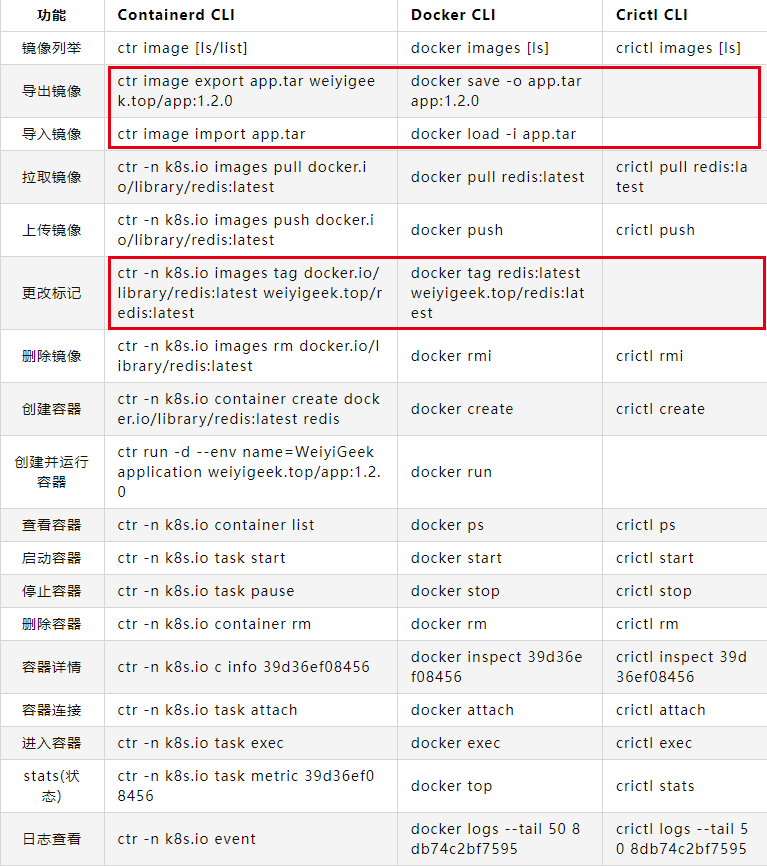

 [TOC]

# kata-rumtime

- kata-runtime check

> WARN[0000] Not running network checks as super user      arch=amd64 name=kata-runtime pid=25571 source=runtime
>
> System is capable of running Kata Containers
>
> System can currently create Kata Containers
 
- kata-runtime env

- kata-runtime metrics fd77dc25ad3e958ded82cc5449c521a00b8300b71981370ba43a757e14ce7b19


## 进入kata虚拟机  kata-runtime  exec
[https://github.com/kata-containers/kata-containers/blob/main/docs/Developer-Guide.md#connect-to-debug-console](https://github.com/kata-containers/kata-containers/blob/main/docs/Developer-Guide.md#connect-to-debug-console)


kata v2环境中考虑到安全性问题不能直接使用kata-runtime exec进入sandbox虚拟机，并且kata release版本的镜像没有包含登录组件，如果要登录需要重新制作sandbox文件系统，登录sandbox需要通过kata-monitor并且sandbox需要在kata-monitor启动之后再启动才能进行调试工作


 - 修改配置 debug_console_enabled

> [agent.kata]
> debug_console_enabled = true


- 启动kata-monitor
```bash
[root@rqy-k8s-1 kbuser]# /opt/kata/bin/kata-monitor
INFO[0000] announce                    app=kata-monitor arch=amd64 git-commit=8d545f7438fc8b1189c1dcc8c414dcc50f7e5587 go-version=go1.17.3 listen-address="127.0.0.1:8090" log-level=info os=linux runtime-endpoint=/run/containerd/containerd.sock version=0.3.0


# 虚拟机里面，是个超级简化的系统，命令奇缺
[root@rqy-k8s-1 kbuser]# kata-runtime exec 1b482bb4613ba606894d30370fe7637610a495d9b3a504bc36e9aa292db9a0f0
bash: grep: command not found
bash: grep: command not found
bash: tty: command not found
bash: expr: command not found
bash: [: : integer expression expected
bash-5.1#
bash-5.1#
bash-5.1# df -h
bash: df: command not found
bash-5.1# lsblk
NAME    MAJ:MIN RM  SIZE RO TYPE MOUNTPOINTS
pmem0   259:0   0  126M  1 disk
`-pmem0p1 259:1   0  124M  1 part /
bash-5.1# ip addr
bash: ip: command not found
bash-5.1# ifconfig
bash: ifconfig: command not found
# 详情见[一个kata容器的创建示例]
```
# crictl

ctr是containerd的一个客户端工具

crictl 是 CRI 兼容的容器运行时命令行接口，可以使用它来检查和调试 Kubernetes 节点上的容器运行时和应用程序

crictl 使用命名空间 k8s.io，即crictl image list = ctr -n=k8s.io image list


crictl config runtime-endpoint unix:///run/containerd/containerd.sock
crictl ps #同docker ps
crictl inspect 
crictl exec
crictl pods # 可以查看哪些是kata容器
crictl images # 同docker images
crictl logs 
```bash
crictl ps | grep stress
86a94ad5059a4  14701355bb465   12 minutes ago   Running    stress   0    7247eaccec1b6
crictl inspect  86a94ad5059a4
crictl exec -it  86a94ad5059a4 bash
rictl stats 86a94ad5059a4
CONTAINER    CPU %     MEM        DISK         INODES
86a94ad5059a4  99.88     1.628GB       0B          13
crictl pods | grep stress
bcfeedf0c17bf   3 minutes ago    Ready   stress-b4fdd868-s8d7n     default     0      kata
crictl images | grep vish/stress
docker.io/vish/stress      latest          14701355bb465    1.56MB
[root@localhost kata]# POD_ID="$(sudo crictl pods --name test -q)"
[root@localhost kata]# echo $POD_ID
2766411ac797b74cdb16fc7a042715e434cfa127c522e45ffe347bd5f7f88cbb
[root@localhost kata]# crictl inspectp -o=json $POD_ID | grep cgroupsPath
 "cgroupsPath": "/kubepods/pod31c20d7a-3733-4b8c-8651-160b23868773/2766411ac797b74cdb16fc7a042715e434cfa127c522e45ffe347bd5f7f88cbb",
 [root@localhost kata]# cat /sys/fs/cgroup/memory/kubepods/pod31c20d7a-3733-4b8c-8651-160b23868773/memory.limit_in_bytes
524288000
[root@rqy-k8s-1 kbuser]# ls /run/vc/vm/
685a6f8538efaee72b1d38efd824aff76241b6ff307e75d3764b3d0606d33894  6d46a824dae01c4675da741ca2aff98b1e7eb005103d10cf0c3af6f758c97afe [root@rqy-k8s-1 kbuser]# kata-runtime exec 685a6f8538efaee72b1d38efd824aff76241b6ff307e75d3764b3d0606d33894 rpc error: code = DeadlineExceeded desc = timed out connecting to vsock 621008089:1026
```


# ctr

ctr -n k8s.io image list

ctr -n k8s.io i export img.tar imgname

ctr -n k8s.io i import img.tar

ctr run -d imgname hfftest


// 测试增加--rm参数退出后删除，否则退出后进程不会删除
ctr -n k8s.io run --runtime io.containerd.kata.v2 -t --rm docker.io/xridge/fio:latest hfftest sh

ctr -n k8s.io t kill -s SIGKILL hfftest
ctr -n k8s.io t rm hfftest
 
ctr -n k8s.io  snapshot rm  hfftest
ctr -n k8s.io  container rm  hfftest

 

ctr -n k8s.io tasks list

ctr -n k8s.io task ps hfftest
ctr -n k8s.io t exec --exec-id $RANDOM -t hfftest sh


 

# 镜像管理命令
dockers images
ctr -n k8s.io images list 
crictl images

docker inspect pause:3.1
crictl inspecti docker.io/vish/stress:latest
ctr无inspec命令

docker pull  vish/stress
ctr -n k8s.io pull vish/stress


# 附件



