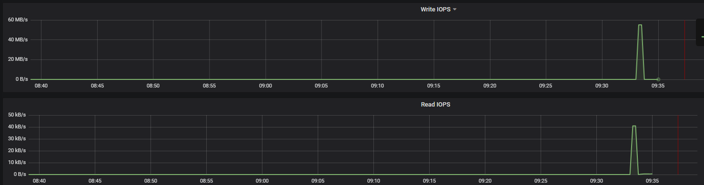

[TOC]
# 从哪些维度去考量kata containers?

1. 容器启动速度

2. cpu、内存性能损耗

3. 资源开销与负载 见[[资源开销]]

4. 网络性能：见[[网络IO]]

5. 文件IO性能：见[[文件IO]]

6. 已知问题验证

7. 资源限制

8. 异常测试

## 调优方向：

使用高性能固态硬盘，或者上spdk，或者使用device mapper

打开iothread

根据不同应用设置内核调优参数

使用轻量化hypervisor（ccloud-hypervisor）

开启vm template，优化启动时间

## 测试环境
## 测试环境版本:

Centos 7.9
qemu-kvm 6.2.0 
Kubernetes 1.17.2
Containerd 1.4.6
Kata Containers 2.4.0

### 单机：

**10.208.11.110（单机）**

> CPU:Intel(R) Core(TM) i7-7700 CPU @ 3.60GHz(4核8线程)
>
> Host Kernel: Linux localhost.localdomain 3.10.0-1160.59.1.el7.x86_64 #1 SMP Wed Feb 23 16:47:03 UTC 2022 x86_64 x86_64 x86_64 GNU/Linux
>
> Guest Kernel: Linux clr-64b293ce5be44f6d9f521c20c5a36249 5.15.23 #2 SMP Mon Mar 7 22:16:36 UTC 2022 x86_64 GNU/Linux

### 集群：

**10.91.0.1-3（集群）**

> CPU: Intel(R) Xeon(R) Silver 4216 CPU @ 2.10GHz（16核64线程）
>
> Host Kernel: Linux rqy-k8s-1 3.10.0-1160.59.1.el7.x86_64 #1 SMP Wed Feb 23 16:47:03 UTC 2022 x86_64 x86_64 x86_64 GNU/Linux
>
> Guest Kernel: Linux clr-f9e79d9d0eb74bbc9f59c716e2fd9795 5.15.23 #2 SMP Mon Mar 7 22:16:36 UTC 2022 x86_64 GNU/Linux


**containerd版本1.4.6**

**kata版本2.4.0**


# 容器启动速度

kata container启动时间构成分析：

1. qemu启动+virtiofsd(vhost-user-fs server)启动+kvm创建vm资源

2. quest os内核态内核bootup

3. quest os用户态systemd+agent启动

4. vm中agent创建container+conatiner启动

## 测试1：测试启动销毁总耗时

**(容器启动+执行命令+容器销毁)**
```bash
time ctr -n k8s.io run --runtime io.containerd.kata.v2 -t --rm docker.io/library/busybox:latest hfftest uname -a
```
## 测试2： vm启动时间
```bash
ctr -n k8s.io run --runtime io.containerd.kata.v2 -t --rm docker.io/library/busybox:latest hfftest dmesg 

$ dmesg | grep Startup

$ systemd-analyze
```

## 测试数据

单机

|      | 启动销毁总耗时 | vm启动时间      |
| ---- | -------------- | --------------- |
| runc | 0.262s         | /               |
| kata | 2.744s         | 226ms（pod/vm） |
```bash
 [root@localhost ~]# time ctr -n k8s.io run --runtime io.containerd.kata.v2 -t --rm docker.io/library/busybox:latest hello uname -a

Linux clr-612c65aedeac414ea353a3af34380e25 5.15.23 #2 SMP Mon Mar 7 22:16:36 UTC 2022 x86_64 GNU/Linux
real   0m2.744s
user   0m0.016s
sys   0m0.015s

[root@localhost ~]# time ctr -n k8s.io run  -t --rm docker.io/library/busybox:latest hello uname -a

Linux localhost.localdomain 3.10.0-1160.59.1.el7.x86_64 #1 SMP Wed Feb 23 16:47:03 UTC 2022 x86_64 GNU/Linux
real   0m0.262s
user   0m0.014s
sys   0m0.015s
 
[root@localhost kata]# ctr -n k8s.io run --runtime io.containerd.kata.v2 -t --rm docker.io/library/busybox:latest dmesg

# dmesg | grep Startup

[   0.228203] systemd[1]: Startup finished in 141ms (kernel) + 84ms (userspace) = 226ms.
[root@localhost ~]# kata-runtime exec dmesg
bash: grep: command not found
bash: grep: command not found
bash: tty: command not found
bash: expr: command not found
bash: [: : integer expression expected
bash-5.1# dmesg
[   0.228203] systemd[1]: Startup finished in 141ms (kernel) + 84ms (userspace) = 226ms.
```
# cpu、内存性能损耗

## CPU：
```bash
ctr -n k8s.io run --runtime io.containerd.kata.v2 -t --rm docker.io/dotnetdr/sysbench:0.5 hfftest sysbench --test=cpu run
```
## 内存：
```bash
ctr -n k8s.io run --runtime io.containerd.kata.v2 -t --rm docker.io/dotnetdr/sysbench:0.5 hfftest sysbench --test=memory --memory-block-size=4k --memory-total-size=4G run
```

## 测试数据

单机

|      | cpu总耗时 | mem总耗时 |
| ---- | --------- | --------- |
| runc | 7.3730s   | 0.3924s   |
| kata | 7.4050s   | 0.3960s   |
| 主机 | 10.0004s  | 0.3175s   |

```bash
ctr -n k8s.io run --runtime io.containerd.kata.v2 -t --rm docker.io/dotnetdr/sysbench:0.5 hfftest sysbench --test=cpu run
[root@localhost kata]# ctr -n k8s.io run --runtime io.containerd.kata.v2 -t --rm docker.io/dotnetdr/sysbench:0.5 hfftest sysbench --test=cpu run
sysbench 0.5:  multi-threaded system evaluation benchmark

Running the test with following options:
Number of threads: 1
Random number generator seed is 0 and will be ignored
Primer numbers limit: 10000
Threads started!
General statistics:
  total time:              7.4050s
  total number of events:        10000
  total time taken by event execution: 7.4020s
  response time:
​     min:                  0.70ms
​     avg:                  0.74ms
​     max:                  3.23ms
​     approx.  95 percentile:        0.81ms
Threads fairness:
  events (avg/stddev):      10000.0000/0.00
  execution time (avg/stddev):  7.4020/0.00
[root@localhost kata]# ctr -n k8s.io run --runtime io.containerd.kata.v2 -t --rm docker.io/dotnetdr/sysbench:0.5 hfftest sysbench --test=memory --memory-block-size=4k --memory-total-size=4G run

sysbench 0.5:  multi-threaded system evaluation benchmark 
Running the test with following options:
Number of threads: 1
Random number generator seed is 0 and will be ignored
Threads started!
Operations performed: 1048576 (2647668.86 ops/sec)
4096.00 MB transferred (10342.46 MB/sec)
General statistics:
  total time:              0.3960s
  total number of events:        1048576
  total time taken by event execution: 0.2954s
  response time:
​     min:                  0.00ms
​     avg:                  0.00ms
​     max:                  0.04ms
​     approx.  95 percentile:        0.00ms
 
Threads fairness:
  events (avg/stddev):      1048576.0000/0.00
  execution time (avg/stddev):  0.2954/0.00
[root@localhost kata]# ctr -n k8s.io run -t --rm docker.io/dotnetdr/sysbench:0.5 hfftest sysbench --test=cpu run
sysbench 0.5:  multi-threaded system evaluation benchmark
Running the test with following options:
Number of threads: 1
Random number generator seed is 0 and will be ignored
Primer numbers limit: 10000
Threads started!
General statistics:
  total time:              7.3730s
  total number of events:        10000
  total time taken by event execution: 7.3705s
  response time:
​     min:                  0.70ms
​     avg:                  0.74ms
​     max:                  1.05ms
​     approx.  95 percentile:        0.81ms
Threads fairness:
  events (avg/stddev):      10000.0000/0.00
  execution time (avg/stddev):  7.3705/0.00
```

**性能损耗低原因：**

高版本的kernal kvm模块、qemu代码做了优化，虚拟化开销<1.5%


# 负载监控数据
## 空闲时负载情况
kata:


runc:


## 1G文件随机写负载情况
```
fio --filename=/test/randwrite --direct=1 --iodepth 1 --thread --rw=randwrite --ioengine=psync --bs=512k --size=5G --numjobs=8 --group_reporting --name=randwrite 
```

- kata:
pod负载数据可能不准，主要参考节点负载情况


kata 5G测试卡死，节点异常

设置sandboxonly=true，测试卡死，但是pod/节点未异常,进程结束。。。


- runc:




runc 1G+5G:


# kata-monitor负载指标


# 其他已知问题验证

## DinD

containerd runc容器支持挂在主机路径的docker.sock，但是kata容器不支持；

containerd runc容器挂载docker.sock有风险，docker重启等问题

kata容器如果需要支持docker命令需要通过DinD边车方案，实现方式参考[[jenkins适配问题]]

 

## 临时存储限制ephemeral-storage（支持）

```yaml
 runtimeClassName: kata-containers
   containers:
   - image: nginx
　　  name: nginx
　　　resources:
　　　 limits:
　　　　　ephemeral-storage: 2Gi
　　　　requests:
　　   　ephemeral-storage: 2Gi
```

Pod启动后，进入容器，执行 dd if=/dev/zero of=/test bs=4096 count=1024000 ，尝试创建一个4Gi的文件：
```bash
[root@rqy-k8s-2 kata]# kubectl exec -it nginx-78cb94bbd5-mw6pc bash
root@nginx-78cb94bbd5-mw6pc:/#
root@nginx-78cb94bbd5-mw6pc:/#
root@nginx-78cb94bbd5-mw6pc:/# dd if=/dev/zero of=/test bs=4096 count=1024000
1024000+0 records in
1024000+0 records out
4194304000 bytes (4.2 GB, 3.9 GiB) copied, 3.24974 s, 1.3 GB/s

roo@nginx-78cb94bbd5-mw6pc:/# command terminated with exit code 137
 
[root@rqy-k8s-2 kbuser]# kubectl get pod -w
NAME           READY  STATUS   RESTARTS  AGE
gitea-64f76f6567-fn72l  1/1   Running  0      14h
nginx-78cb94bbd5-mw6pc  1/1   Running  0      81s
nginx-78cb94bbd5-mw6pc  0/1   Evicted  0      116s
nginx-78cb94bbd5-nngc4  0/1   Pending  0      1s
nginx-78cb94bbd5-nngc4  0/1   Pending  0      1s
nginx-78cb94bbd5-nngc4  0/1   ContainerCreating  0      1s
nginx-78cb94bbd5-nngc4  1/1   Running       0      22s
```
## kata不支持subPaths(emptyDir )

但不影响挂载configmap使用

## kata不支持host网络

pod可以创建，但是不支持host网络特性，未使用主机端口

## privilige与runc容器不相同

### enable_cpu_memory_hotplug=false不支持--priviliged：
Warning  Failed   13s (x2 over 15s)  kubelet, rqy-k8s-3  Error: failed to create containerd task: Conflicting device updates for /dev/dm-1: unknown
Warning  BackOff   12s (x2 over 13s)  kubelet, rqy-k8s-3  Back-off restarting failed container

```
[plugins.cri.containerd.runtimes.kata]
  runtime_type = " io.containerd.kata.v2 " 
  privileged_without_host_devices = true
```


## 内核版本

### 5.15.23（2.4.0-rc0）
```bash
[root@rqy-k8s-1 kbuser]# kubectl exec -it netperf-server-kata -- cat /proc/version
Linux version 5.15.23 (root@655cd71e6195) (gcc (Ubuntu 9.4.0-1ubuntu1~20.04) 9.4.0, GNU ld (GNU Binutils for Ubuntu) 2.34) #2 SMP Mon Mar 7 22:16:36 UTC 2022
[root@rqy-k8s-1 kbuser]# kubectl exec -it netperf-server-default -- cat /proc/version
Linux version 3.10.0-1160.59.1.el7.x86_64 (mockbuild@kbuilder.bsys.centos.org) (gcc version 4.8.5 20150623 (Red Hat 4.8.5-44) (GCC) ) #1 SMP Wed Feb 23 16:47:03 UTC 2022
```

### 5.10.25( 2.4.0-alpha2)

### 4.19.86（kata1.10.8）


## 超分

### cpu超分风险不大
```bash
[root@localhost kata]# kubectl top pod
NAME             CPU(cores)  MEMORY(bytes)
test-1-5687dbdf79-ddxdn   4977m     1Mi
test-2-5889c67db7-nm4cb   4917m     1Mi
test-3-5d6bd7fb66-p9gv2   4948m     1Mi
test-4-b47b67ff-srsn2    4938m     1Mi
test-5-7db59fb7cb-9fxpw   4929m     1Mi
test-6-566cc7dcff-wzsfv   4942m     1Mi
test-7-5976f4569f-dpxd2   4904m     1Mi
test-kata-cfbbd954b-jt49k  2007m     1Mi
```
 

### 内存超分有风险
```bash
[root@localhost kata]# crictl stats 915587983fee9

CONTAINER      CPU %        MEM         DISK         INODES
915587983fee9    95.24        3.254GB       0B          13
```
内存超分可能会导致业务被杀死，系统卡死

# 异常测试

## 重启节点上的kata-deploy

kata pod没有被重启，但是默认配置会被还原（需注意）