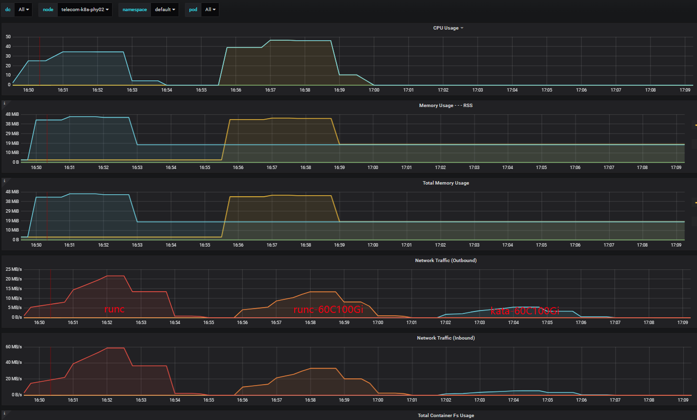
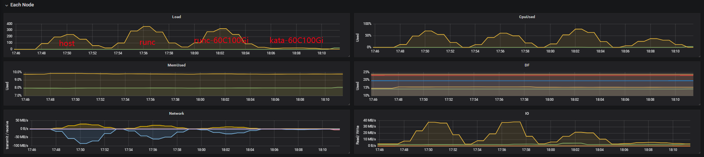
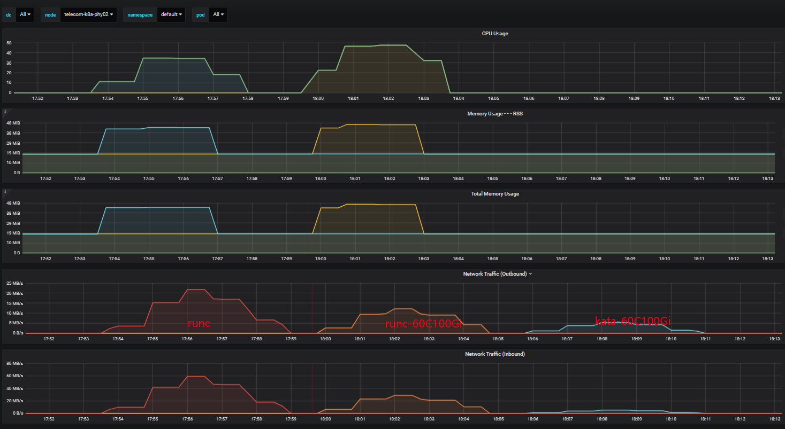

 [TOC]


# 前言
- k8s的最小调度单位为pod，pod网络通信的实现依赖于第三方插件；容器云使用calico纯三层虚拟网络方案，可以避免与其他二层方案相关的数据包封装的操作，中间没有任何的NAT，没有任何的overlay，几乎能达到主机性能。
- kata增加了一层tcfilter（默认）打通虚拟机与容器之间的网络
- 由于kata容器必须设置资源限制才能分配较大的资源，且无法设置主机资源的最大值，因此kata容器无法与主机对等测试，此次测试分两个对比测试：host vs runc、runc vs kata

# 测试环境
- 节点2上20GE网口，在节点2上创建测试pod，在节点3上跨节点测试节点2主机及容器服务。
- runc vs kata资源限制request 1C2G/limit 60C100Gi
- kata设置debug_console_enabled=false（kata虚拟机开销不限制）
```
[root@telecom-k8s-phy02 kbuser]# kubectl get node -o wide
NAME                STATUS   ROLES    AGE   VERSION   INTERNAL-IP   EXTERNAL-IP   OS-IMAGE                KERNEL-VERSION                CONTAINER-RUNTIME
telecom-k8s-phy01   Ready    master   26d   v1.17.2   10.96.0.1     <none>        CentOS Linux 7 (Core)   3.10.0-1160.59.1.el7.x86_64   containerd://1.4.6
telecom-k8s-phy02   Ready    master   26d   v1.17.2   10.96.0.2     <none>        CentOS Linux 7 (Core)   3.10.0-1160.59.1.el7.x86_64   containerd://1.4.6

[root@telecom-k8s-phy02 kbuser]# ethtool bond0
Settings for bond0:
        Supported ports: [ ]
        Supported link modes:   Not reported
        Supported pause frame use: No
        Supports auto-negotiation: No
        Supported FEC modes: Not reported
        Advertised link modes:  Not reported
        Advertised pause frame use: No
        Advertised auto-negotiation: No
        Advertised FEC modes: Not reported
        Speed: 20000Mb/s
        Duplex: Full
        Port: Other
        PHYAD: 0
        Transceiver: internal
        Auto-negotiation: off
        Link detected: yes

[root@telecom-k8s-phy01 hff]# kubectl get pod
NAME                                        READY   STATUS             RESTARTS   AGE
test-kata-httpd-60c100gi-899c74856-mbxkp    1/1     Running            0          99s
test-runc-httpd-60c100gi-7f498bc4b6-mpdgl   1/1     Running            0          8s
test-runc-httpd-6cd55b978-7pz7j             1/1     Running            0          22m
[root@telecom-k8s-phy01 hff]# kubectl get svc
NAME                       TYPE        CLUSTER-IP       EXTERNAL-IP   PORT(S)                               AGE
test-kata-httpd-60c100gi   NodePort    10.196.46.42     <none>        80:30002/TCP                          16m
test-runc-httpd            NodePort    10.196.26.12     <none>        80:30000/TCP                          5d23h
test-runc-httpd-60c100gi   NodePort    10.196.53.164    <none>        80:30001/TCP                          21m
```


# 测试工具与测试方法

## wrk
wrk是一款高性能的http请求压测工具，它使用了Epoll模型，使所有请求都是异步非阻塞模式的，因此对系统资源能够应用到极致，可以压满 cpu。
```bash
# 30个线程，20000个连接，压测时间3m
./wrk -t30 -c20000 -d3m <url>
```

TPS：每秒处理的事务数（比如每秒处理的订单数）
QPS：每秒处理的请求数
-c, --connections <N>  跟服务器建立并保持的TCP连接数量  
-d, --duration    <T>  压测时间           
-t, --threads     <N>  使用多少个线程进行压测   
-R, --rate        <T>  工作速率（吞吐量）即每个线程每秒钟完成的请求数


## 30线程20000连接数3min测试结果:
|                  | QPS       |   TPS    | Latency(avg) |    error    |
|------------------|-----------|----------|--------------|-------------|
|host              |229242.62|62.57MB|4.85ms|read 1274911, write 133816, timeout 47
|runc容器          |168990.93|43.53MB|3.34ms|read 1652945, write 122147, timeout 456
|runc容器(60C100Gi)|94544.10|24.35MB|5.80ms|read 1803348, write 156906, timeout 104
|kata容器(60C100Gi)|8108.71|2.09MB|112.63ms|read 228280, write 130705, timeout 18253





## 120线程20000连接数3min测试结果:
|                  | QPS       |   TPS    | Latency(avg) |    error    |
|------------------|-----------|----------|--------------|-------------|
|host              |234540.85|64.01MB|4.67ms|read 1484673, write 130834, timeout 14
|runc容器          |169751.04|43.73MB|3.30ms|read 1725769, write 127344, timeout 108
|runc容器(60C100Gi)|80021.39|20.61MB|6.79ms|read 1985436, write 166381, timeout 115
|kata容器(60C100Gi)|8113.26|2.09MB|112.81ms|read 228508, write 129791, timeout 18391





# yaml
```bash
---
kind: Deployment
apiVersion: apps/v1
metadata:
  name: test-runc-httpd
spec:
  selector:
    matchLabels:
      app: test-runc-httpd
  template:
    metadata:
      labels:
        app: test-runc-httpd
    spec:
      nodeName: telecom-k8s-phy02
      containers:
      - name: httpd-runc
        image: httpd
        imagePullPolicy: IfNotPresent

---
kind: Deployment
apiVersion: apps/v1
metadata:
  name: test-runc-httpd-60c100gi
spec:
  selector:
    matchLabels:
      app: test-runc-httpd-60c100gi
  template:
    metadata:
      labels:
        app: test-runc-httpd-60c100gi
    spec:
      nodeName: telecom-k8s-phy02
      containers:
      - name: httpd-runc-60c100gi
        image: httpd
        imagePullPolicy: IfNotPresent
        resources:
          limits:
            memory: "100Gi"
            cpu: "60"
          requests:
            memory: "1Gi"
            cpu: "1"

---
kind: Deployment
apiVersion: apps/v1
metadata:
  name: test-kata-httpd-60c100gi
spec:
  selector:
    matchLabels:
      app: test-kata-httpd-60c100gi
  template:
    metadata:
      labels:
        app: test-kata-httpd-60c100gi
    spec:
      runtimeClassName: kata
      nodeName: telecom-k8s-phy02
      containers:
      - name: httpd-kata-60c100gi
        image: httpd
        imagePullPolicy: IfNotPresent
        resources:
          limits:
            memory: "100Gi"
            cpu: "60"
          requests:
            memory: "1Gi"
            cpu: "1"
```

# 测试脚本 nohup sh wrk-t120-c20000-3m.sh
```shell
#!/usr/bin/env bash
date  >> wrk-t30-c20000.log
echo ">>host: "  >> wrk-t120-c20000.log
./wrk -t120 -c20000 -d3m http://10.96.0.2:40080/ >> wrk-t120-c20000.log
sleep 3m
date  >> wrk-t120-c20000.log
echo ">>runc:"  >> wrk-t120-c20000.log
./wrk -t120 -c20000 -d3m http://10.96.0.2:30000/ >> wrk-t120-c20000.log
sleep 3m
date  >> wrk-t120-c20000.log
echo ">>runc-60C100Gi:"  >> wrk-t120-c20000.log
./wrk -t120 -c20000 -d3m http://10.96.0.2:30001/ >> wrk-t120-c20000.log
sleep 3m
date  >> wrk-t120-c20000.log
echo ">>kata-60C100Gi:"  >> wrk-t120-c20000.log
./wrk -t120 -c20000 -d3m http://10.96.0.2:30002/ >> wrk-t120-c20000.log
```

# 测试数据
## wrk-t30-c20000-3m
```bash
>>host:
Running 3m test @ http://10.96.0.2:40080/
  30 threads and 20000 connections
  Thread Stats   Avg      Stdev     Max   +/- Stdev
    Latency     4.85ms   29.64ms   1.86s    97.34%
    Req/Sec     7.88k     3.17k   36.91k    74.94%
  41286590 requests in 3.00m, 11.00GB read
  Socket errors: connect 0, read 1274911, write 133816, timeout 47
Requests/sec: 229242.62
Transfer/sec:     62.57MB
>>runc:
Running 3m test @ http://10.96.0.2:30000/
  30 threads and 20000 connections
  Thread Stats   Avg      Stdev     Max   +/- Stdev
    Latency     3.34ms   16.58ms   1.74s    98.13%
    Req/Sec     5.66k     1.57k   20.19k    70.30%
  30435341 requests in 3.00m, 7.66GB read
  Socket errors: connect 0, read 1652945, write 122147, timeout 456
Requests/sec: 168990.93
Transfer/sec:     43.53MB
>>runc-60C100Gi:
Running 3m test @ http://10.96.0.2:30001/
  30 threads and 20000 connections
  Thread Stats   Avg      Stdev     Max   +/- Stdev
    Latency     5.80ms   24.95ms   1.96s    95.55%
    Req/Sec     3.17k     2.44k   33.54k    67.59%
  17027231 requests in 3.00m, 4.28GB read
  Socket errors: connect 0, read 1803348, write 156906, timeout 104
Requests/sec:  94544.10
Transfer/sec:     24.35MB
>>kata-60C100Gi:
Running 3m test @ http://10.96.0.2:30002/
  30 threads and 20000 connections
  Thread Stats   Avg      Stdev     Max   +/- Stdev
    Latency   112.63ms  214.84ms   2.00s    91.06%
    Req/Sec   275.47    153.41     2.52k    75.40%
  1460354 requests in 3.00m, 376.03MB read
  Socket errors: connect 0, read 228280, write 130705, timeout 18253
Requests/sec:   8108.71
Transfer/sec:      2.09MB

```

## wrk-t120-c20000-3m
```bash
>>host:
Running 3m test @ http://10.96.0.2:40080/
  120 threads and 20000 connections
  Thread Stats   Avg      Stdev     Max   +/- Stdev
    Latency     4.67ms   27.82ms   1.94s    97.02%
    Req/Sec     2.05k     1.65k   75.11k    84.90%
  42241356 requests in 3.00m, 11.26GB read
  Socket errors: connect 0, read 1484673, write 130834, timeout 14
Requests/sec: 234540.85
Transfer/sec:     64.01MB
Mon May 23 17:53:24 CST 2022
>>runc:
Running 3m test @ http://10.96.0.2:30000/
  120 threads and 20000 connections
  Thread Stats   Avg      Stdev     Max   +/- Stdev
    Latency     3.30ms   15.21ms   1.69s    98.13%
    Req/Sec     1.44k   770.34    43.58k    70.30%
  30572241 requests in 3.00m, 7.69GB read
  Socket errors: connect 0, read 1725769, write 127344, timeout 108
Requests/sec: 169751.04
Transfer/sec:     43.73MB
Mon May 23 17:59:25 CST 2022
>>runc-60C100Gi:
Running 3m test @ http://10.96.0.2:30001/
  120 threads and 20000 connections
  Thread Stats   Avg      Stdev     Max   +/- Stdev
    Latency     6.79ms   26.36ms   1.91s    94.78%
    Req/Sec   689.07    705.47    32.54k    84.57%
  14411946 requests in 3.00m, 3.63GB read
  Socket errors: connect 0, read 1985436, write 166381, timeout 115
Requests/sec:  80021.39
Transfer/sec:     20.61MB
Mon May 23 18:05:25 CST 2022
>>kata-60C100Gi:
Running 3m test @ http://10.96.0.2:30002/
  120 threads and 20000 connections
  Thread Stats   Avg      Stdev     Max   +/- Stdev
    Latency   112.81ms  214.35ms   2.00s    91.11%
    Req/Sec    76.86     75.63     4.44k    90.67%
  1461207 requests in 3.00m, 376.25MB read
  Socket errors: connect 0, read 228508, write 129791, timeout 18391
Requests/sec:   8113.26
Transfer/sec:      2.09MB

```