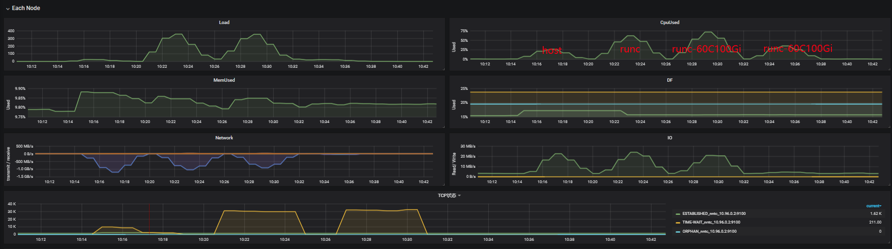
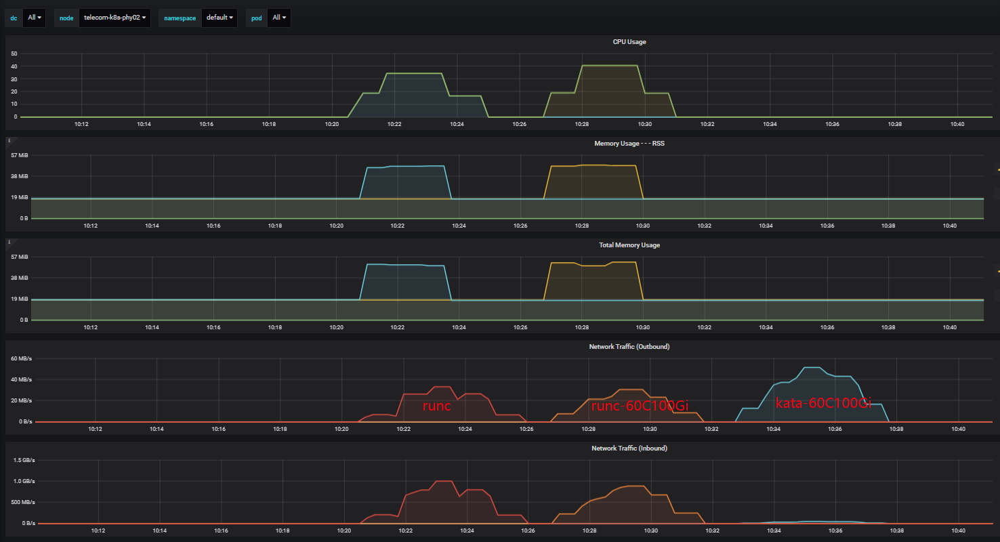

 [TOC]


# 前言
- k8s的最小调度单位为pod，pod网络通信的实现依赖于第三方插件；容器云使用calico纯三层虚拟网络方案，可以避免与其他二层方案相关的数据包封装的操作，中间没有任何的NAT，没有任何的overlay，几乎能达到主机性能。
- kata增加了一层tcfilter（默认）打通虚拟机与容器之间的网络
- 由于kata容器必须设置资源限制才能分配较大的资源，且无法设置主机资源的最大值，因此kata容器无法与主机对等测试，此次测试分两个对比测试：host vs runc、runc vs kata

# 测试步骤
- 在节点2上创建测试pod，在节点3上跨节点测试节点2主机及容器服务。节点2网口速率20000Mb/s。
- 宿主机及容器中部署httpd，提供一个相同的静态页面请求服务，通过node port暴露容器服务。

参数备注：
- runc vs kata资源限制request 1C2G/limit 60C100Gi
- kata设置debug_console_enabled=false（kata虚拟机开销不限制）
```
[root@telecom-k8s-phy02 kbuser]# kubectl get node -o wide
NAME                STATUS   ROLES    AGE   VERSION   INTERNAL-IP   EXTERNAL-IP   OS-IMAGE                KERNEL-VERSION                CONTAINER-RUNTIME
telecom-k8s-phy01   Ready    master   26d   v1.17.2   10.96.0.1     <none>        CentOS Linux 7 (Core)   3.10.0-1160.59.1.el7.x86_64   containerd://1.4.6
telecom-k8s-phy02   Ready    master   26d   v1.17.2   10.96.0.2     <none>        CentOS Linux 7 (Core)   3.10.0-1160.59.1.el7.x86_64   containerd://1.4.6

[root@telecom-k8s-phy01 hff]# kubectl get pod
NAME                                        READY   STATUS             RESTARTS   AGE
test-kata-httpd-60c100gi-899c74856-mbxkp    1/1     Running            0          99s
test-runc-httpd-60c100gi-7f498bc4b6-mpdgl   1/1     Running            0          8s
test-runc-httpd-6cd55b978-7pz7j             1/1     Running            0          22m
[root@telecom-k8s-phy01 hff]# kubectl get svc
NAME                       TYPE        CLUSTER-IP       EXTERNAL-IP   PORT(S)                               AGE
test-kata-httpd-60c100gi   NodePort    10.196.46.42     <none>        80:30002/TCP                          16m
test-runc-httpd            NodePort    10.196.26.12     <none>        80:30000/TCP                          5d23h
test-runc-httpd-60c100gi   NodePort    10.196.53.164    <none>        80:30001/TCP                          21m
```


# 测试工具与测试方法

## wrk
wrk是一款高性能的http请求压测工具，它使用了Epoll模型，使所有请求都是异步非阻塞模式的，因此对系统资源能够应用到极致，可以压满 cpu。
```bash
# 100个线程，20000个连接，压测时间3m
./wrk -t100 -c20000 -d3m <url>
```

TPS：每秒处理的事务数（比如每秒处理的订单数）
QPS：每秒处理的请求数
-c, --connections <N>  跟服务器建立并保持的TCP连接数量  
-d, --duration    <T>  压测时间           
-t, --threads     <N>  使用多少个线程进行压测   
-R, --rate        <T>  工作速率（吞吐量）即每个线程每秒钟完成的请求数


## 100线程20000连接数3min测试结果:
|                  | QPS       |   TPS    | Latency(avg) |    error    |
|------------------|-----------|----------|--------------|-------------|
|host              |112756.18|0.97GB|10.30ms|read 947060, write 136108, timeout 481
|runc容器          |107223.28|0.92GB|6.64ms|read 5088561, write 25802, timeout 1762
|runc容器(60C100Gi)|93604.62|822.25MB|8.39ms|read 4901636, write 48406, timeout 3744
|kata容器(60C100Gi)|5341.29|46.92MB|149.51ms|read 139912, write 139037, timeout 15382




注： kata pod cpu、mem promethues公式需要修改，否则获取不到数据

# 测试脚本 
> nohup sh wrk-t100-c20000-3m.sh

```shell
#!/usr/bin/env bash
date  >> wrk-t100-c20000.log
echo ">>host: "  >> wrk-t100-c20000.log
./wrk -t100 -c20000 -d3m http://10.96.0.2:40080/ >> wrk-t100-c20000.log
sleep 3m
date  >> wrk-t100-c20000.log
echo ">>runc:"  >> wrk-t100-c20000.log
./wrk -t100 -c20000 -d3m http://10.96.0.2:30000/ >> wrk-t100-c20000.log
sleep 3m
date  >> wrk-t100-c20000.log
echo ">>runc-60C100Gi:"  >> wrk-t100-c20000.log
./wrk -t100 -c20000 -d3m http://10.96.0.2:30001/ >> wrk-t100-c20000.log
sleep 3m
date  >> wrk-t100-c20000.log
echo ">>kata-60C100Gi:"  >> wrk-t100-c20000.log
./wrk -t100 -c20000 -d3m http://10.96.0.2:30002/ >> wrk-t100-c20000.log
```


# 测试数据

## wrk-t100-c20000-3m
```bash
Tue May 24 10:14:18 CST 2022
>>host:
Running 3m test @ http://10.96.0.2:40080/
  100 threads and 20000 connections
  Thread Stats   Avg      Stdev     Max   +/- Stdev
    Latency    10.30ms   59.39ms   2.00s    97.81%
    Req/Sec     1.20k     1.23k   56.92k    91.70%
  20307833 requests in 3.00m, 174.61GB read
  Socket errors: connect 0, read 947060, write 136108, timeout 481
Requests/sec: 112756.18
Transfer/sec:      0.97GB
Tue May 24 10:20:18 CST 2022
>>runc:
Running 3m test @ http://10.96.0.2:30000/
  100 threads and 20000 connections
  Thread Stats   Avg      Stdev     Max   +/- Stdev
    Latency     6.64ms   39.08ms   1.67s    99.65%
    Req/Sec     1.08k   424.64    19.77k    70.02%
  19310950 requests in 3.00m, 165.66GB read
  Socket errors: connect 0, read 5088561, write 25802, timeout 1762
Requests/sec: 107223.28
Transfer/sec:      0.92GB
Tue May 24 10:26:19 CST 2022
>>runc-60C100Gi:
Running 3m test @ http://10.96.0.2:30001/
  100 threads and 20000 connections
  Thread Stats   Avg      Stdev     Max   +/- Stdev
    Latency     8.39ms   50.28ms   1.80s    98.88%
    Req/Sec     0.94k   486.40    19.30k    67.51%
  16858225 requests in 3.00m, 144.62GB read
  Socket errors: connect 0, read 4901636, write 48406, timeout 3744
Requests/sec:  93604.62
Transfer/sec:    822.25MB
Tue May 24 10:32:19 CST 2022
>>kata-60C100Gi:
Running 3m test @ http://10.96.0.2:30002/
  100 threads and 20000 connections
  Thread Stats   Avg      Stdev     Max   +/- Stdev
    Latency   149.51ms  305.97ms   2.00s    94.09%
    Req/Sec    60.10     60.64     3.10k    90.96%
  961964 requests in 3.00m, 8.25GB read
  Socket errors: connect 0, read 139912, write 139037, timeout 15382
Requests/sec:   5341.29
Transfer/sec:     46.92MB
```


# yaml
```bash
---
kind: Deployment
apiVersion: apps/v1
metadata:
  name: test-runc-httpd
spec:
  selector:
    matchLabels:
      app: test-runc-httpd
  template:
    metadata:
      labels:
        app: test-runc-httpd
    spec:
      nodeName: telecom-k8s-phy02
      containers:
      - name: httpd-runc
        image: httpd
        imagePullPolicy: IfNotPresent

---
kind: Deployment
apiVersion: apps/v1
metadata:
  name: test-runc-httpd-60c100gi
spec:
  selector:
    matchLabels:
      app: test-runc-httpd-60c100gi
  template:
    metadata:
      labels:
        app: test-runc-httpd-60c100gi
    spec:
      nodeName: telecom-k8s-phy02
      containers:
      - name: httpd-runc-60c100gi
        image: httpd
        imagePullPolicy: IfNotPresent
        resources:
          limits:
            memory: "100Gi"
            cpu: "60"
          requests:
            memory: "1Gi"
            cpu: "1"

---
kind: Deployment
apiVersion: apps/v1
metadata:
  name: test-kata-httpd-60c100gi
spec:
  selector:
    matchLabels:
      app: test-kata-httpd-60c100gi
  template:
    metadata:
      labels:
        app: test-kata-httpd-60c100gi
    spec:
      runtimeClassName: kata
      nodeName: telecom-k8s-phy02
      containers:
      - name: httpd-kata-60c100gi
        image: httpd
        imagePullPolicy: IfNotPresent
        resources:
          limits:
            memory: "100Gi"
            cpu: "60"
          requests:
            memory: "1Gi"
            cpu: "1"
```