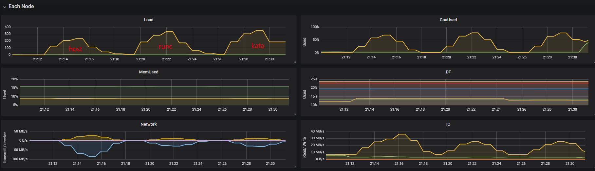
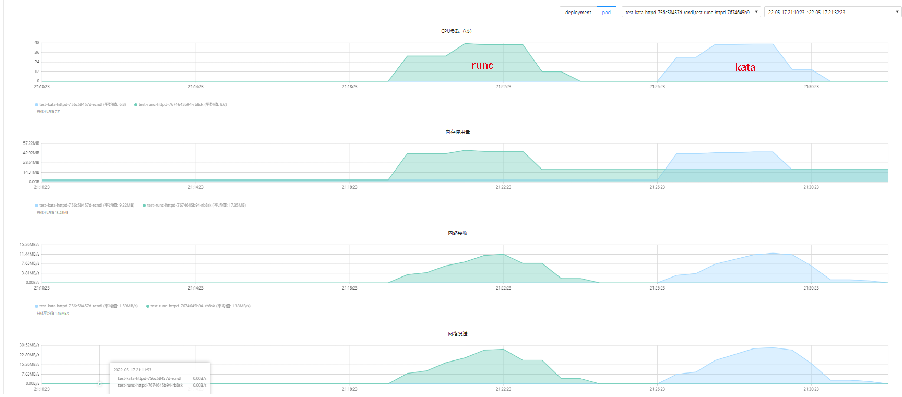

 [TOC]


# 当前容器云网络模型及网络开销说明
k8s的最小调度单位为pod，pod网络通信的实现依赖于第三方插件；容器云使用calico纯三层虚拟网络方案，可以避免与其他二层方案相关的数据包封装的操作，中间没有任何的NAT，没有任何的overlay，几乎能达到主机性能。
kata增加了一层tcfilter（默认）打通虚拟机与容器之间的网络


**测试配置说明:**
- kata资源限制request 1C2G /limit 60C240G，如果不设置则使用默认值，
- kata设置debug_console_enabled=true（虚拟机开销占用业务开销）
- kata设置debug_console_enabled=false（虚拟机开销不限制）


```bash
[root@telecom-k8s-phy01 hff]# kubectl get pod -o wide
NAME                                READY   STATUS    RESTARTS   AGE    IP               NODE                NOMINATED NODE   READINESS GATES
qperf-server-fb799f5-cs4lr          1/1     Running   0          35s    10.196.142.181   telecom-k8s-phy02   <none>           <none>
qperf-server-kata-c86cddfbf-w66kp   1/1     Running   0          35s    10.196.142.191   telecom-k8s-phy02   <none>           <none>
test-kata-httpd-6c466d4c5-xkgzz     1/1     Running   1          116s   10.196.142.184   telecom-k8s-phy02   <none>           <none>
test-runc-httpd-7cf5cc96bf-htcnm    1/1     Running   0          116s   10.196.142.135   telecom-k8s-phy02   <none>           <none>
[root@telecom-k8s-phy01 hff]# kubectl get svc -o wide
NAME                TYPE        CLUSTER-IP       EXTERNAL-IP   PORT(S)                               AGE   SELECTOR
qperf-server        ClusterIP   10.196.110.238   <none>        4000/UDP,4000/TCP,4001/UDP,4001/TCP   40s   k8s-app=qperf-server
qperf-server-kata   ClusterIP   10.196.65.215    <none>        4000/UDP,4000/TCP,4001/UDP,4001/TCP   40s   k8s-app=qperf-server-kata
test-kata-httpd     NodePort    10.196.97.40     <none>        80:28394/TCP                          17h   app=test-kata-httpd
test-runc-httpd     NodePort    10.196.26.12     <none>        80:21020/TCP                          17h   app=test-runc-httpd
```


# qperf
qperf和iperf/netperf一样可以评测两个节点之间的带宽和延时。可以在测试tcp/ip协议和RDMA传输。不过相比netperf和iperf，支持RDMA是qperf工具的独有特性。
- 循环测试1bytes-64KiB的带宽和延迟
```bash
qperf <ip> -oo msg_size:1:256K:*64 -vu tcp_bw tcp_lat
```

**注意:**
qperf测试service有问题：
1. 对于runc容器，需要修改qperf服务监听端口，否则跨节点无法测试
2. 对于kata容器，本节点和跨节点都无法测试

## 测试结果:
|msg_size   |宿主机服务端|runc容器服务端|kata容器服务端(true)|
|-----------|-----------|-------------|--------- |
|1bytes     |
|64bytes    |
|4KiB       |
|256KiB     |

tcp_lat: <br>tcp_bw: 

# wrk测试
wrk是一款高性能的http请求压测工具，它使用了Epoll模型，使所有请求都是异步非阻塞模式的，因此对系统资源能够应用到极致，可以压满 cpu。
```bash
# 64个线程，20000个连接，压测时间3m
./wrk -t64 -c20000 -d3m <url>
```


TPS：每秒处理的事务数（比如每秒处理的订单数）
QPS：每秒处理的请求数
-c, --connections <N>  跟服务器建立并保持的TCP连接数量  
-d, --duration    <T>  压测时间           
-t, --threads     <N>  使用多少个线程进行压测   
-R, --rate        <T>  工作速率（吞吐量）即每个线程每秒钟完成的请求数


## 64线程20000连接数3min测试结果:
|              | QPS       |   TPS    | Latency(avg) |    error    |
|--------------|-----------|----------|--------------|-------------|
|host          | 230910.47|63.02MB|4.75ms|read 1434651, write 133952, timeout 39
|runc容器      |84392.93|21.74MB|6.42ms|read 1847398, write 162476, timeout 203
|kata容器(true)|86458.97|22.27MB|6.25ms|read 1862819, write 162433, timeout 198






# 测试数据
## qperf
### 宿主机
```bash
[root@telecom-k8s-phy01 kbuser]# qperf 10.96.0.1  -oo msg_size:1:256K:*64 -vu tcp_bw tcp_lat
tcp_bw:
    bw        =  1.13 MB/sec
    msg_size  =     1 bytes
tcp_bw:
    bw        =  77 MB/sec
    msg_size  =  64 bytes
tcp_bw:
    bw        =  1.71 GB/sec
    msg_size  =     4 KiB (4,096)
tcp_bw:
    bw        =  3.48 GB/sec
    msg_size  =   256 KiB (262,144)
tcp_lat:
    latency   =  13 us
    msg_size  =   1 bytes
tcp_lat:
    latency   =  12.9 us
    msg_size  =    64 bytes
tcp_lat:
    latency   =  14.1 us
    msg_size  =     4 KiB (4,096)
tcp_lat:
    latency   =  68.8 us
    msg_size  =   256 KiB (262,144)
[root@telecom-k8s-phy02 kbuser]# qperf 10.96.0.1  -oo msg_size:1:256K:*64 -vu tcp_bw tcp_lat
tcp_bw:
    bw        =  1.19 MB/sec
    msg_size  =     1 bytes
tcp_bw:
    bw        =  54.2 MB/sec
    msg_size  =    64 bytes
tcp_bw:
    bw        =  1.13 GB/sec
    msg_size  =     4 KiB (4,096)
tcp_bw:
    bw        =  1.15 GB/sec
    msg_size  =   256 KiB (262,144)
tcp_lat:
    latency   =  15.9 us
    msg_size  =     1 bytes
tcp_lat:
    latency   =  16.2 us
    msg_size  =    64 bytes
tcp_lat:
    latency   =  28.8 us
    msg_size  =     4 KiB (4,096)
tcp_lat:
    latency   =  315 us
    msg_size  =  256 KiB (262,144)
```
### runc
```bash
[root@telecom-k8s-phy01 kbuser]# qperf 10.196.192.101 -lp 4000 -ip 4001 -oo msg_size:1:256K:*64 -vu tcp_bw tcp_lat
tcp_bw:
    bw        =   1.14 MB/sec
    msg_size  =      1 bytes
    port      =  4,001
tcp_bw:
    bw        =   42.6 MB/sec
    msg_size  =     64 bytes
    port      =  4,001
tcp_bw:
    bw        =    335 MB/sec
    msg_size  =      4 KiB (4,096)
    port      =  4,001
tcp_bw:
    bw        =   3.39 GB/sec
    msg_size  =    256 KiB (262,144)
    port      =  4,001
tcp_lat:
    latency   =   12.5 us
    msg_size  =      1 bytes
    port      =  4,001
tcp_lat:
    latency   =   12.6 us
    msg_size  =     64 bytes
    port      =  4,001
tcp_lat:
    latency   =   20.2 us
    msg_size  =      4 KiB (4,096)
    port      =  4,001
tcp_lat:
    latency   =   92.1 us
    msg_size  =    256 KiB (262,144)
    port      =  4,001


[root@telecom-k8s-phy02 kbuser]# qperf 10.196.192.101 -lp 4000 -ip 4001 -oo msg_size:1:256K:*64 -vu tcp_bw tcp_lat
tcp_bw:
    bw        =   1.17 MB/sec
    msg_size  =      1 bytes
    port      =  4,001
tcp_bw:
    bw        =     69 MB/sec
    msg_size  =     64 bytes
    port      =  4,001
tcp_bw:
    bw        =   1.16 GB/sec
    msg_size  =      4 KiB (4,096)
    port      =  4,001
tcp_bw:
    bw        =   1.17 GB/sec
    msg_size  =    256 KiB (262,144)
    port      =  4,001
tcp_lat:
    latency   =   19.2 us
    msg_size  =      1 bytes
    port      =  4,001
tcp_lat:
    latency   =   18.8 us
    msg_size  =     64 bytes
    port      =  4,001
tcp_lat:
    latency   =   34.1 us
    msg_size  =      4 KiB (4,096)
    port      =  4,001
tcp_lat:
    latency   =    397 us
    msg_size  =    256 KiB (262,144)
    port      =  4,001

```

### kata
```bash
[root@telecom-k8s-phy01 kbuser]# qperf 10.196.192.79 -lp 4000 -ip 4001 -oo msg_size:1:256K:*64 -vu tcp_bw tcp_lattcp_bw:
    bw        =   1.05 MB/sec
    msg_size  =      1 bytes
    port      =  4,001
tcp_bw:
    bw        =   45.6 MB/sec
    msg_size  =     64 bytes
    port      =  4,001
tcp_bw:
    bw        =    355 MB/sec
    msg_size  =      4 KiB (4,096)
    port      =  4,001
tcp_bw:
    bw        =   3.13 GB/sec
    msg_size  =    256 KiB (262,144)
    port      =  4,001
tcp_lat:
    latency   =   20.2 us
    msg_size  =      1 bytes
    port      =  4,001
tcp_lat:
    latency   =   19.3 us
    msg_size  =     64 bytes
    port      =  4,001
tcp_lat:
    latency   =   25.7 us
    msg_size  =      4 KiB (4,096)
    port      =  4,001
tcp_lat:
    latency   =    167 us
    msg_size  =    256 KiB (262,144)
    port      =  4,001
[root@telecom-k8s-phy02 kbuser]# qperf 10.196.192.79 -lp 4000 -ip 4001 -oo msg_size:1:256K:*64 -vu tcp_bw tcp_lattcp_bw:
    bw        =   1.08 MB/sec
    msg_size  =      1 bytes
    port      =  4,001
tcp_bw:
    bw        =     55 MB/sec
    msg_size  =     64 bytes
    port      =  4,001
tcp_bw:
    bw        =   1.13 GB/sec
    msg_size  =      4 KiB (4,096)
    port      =  4,001
tcp_bw:
    bw        =   1.16 GB/sec
    msg_size  =    256 KiB (262,144)
    port      =  4,001
tcp_lat:
    latency   =   28.9 us
    msg_size  =      1 bytes
    port      =  4,001
tcp_lat:
    latency   =   29.7 us
    msg_size  =     64 bytes
    port      =  4,001
tcp_lat:
    latency   =   45.7 us
    msg_size  =      4 KiB (4,096)
    port      =  4,001
tcp_lat:
    latency   =    338 us
    msg_size  =    256 KiB (262,144)
    port      =  4,001
```

## wrk
```bash
# 宿主机
[root@telecom-k8s-phy03 wrk-master]# ./wrk -t64 -c20000 -d3m http://10.96.0.2:40080/
Running 3m test @ http://10.96.0.2:40080/
  64 threads and 20000 connections
  Thread Stats   Avg      Stdev     Max   +/- Stdev
    Latency     4.63ms   27.66ms   1.99s    97.07%
    Req/Sec     3.76k     2.33k   51.04k    81.79%
  42374542 requests in 3.00m, 11.29GB read
  Socket errors: connect 0, read 1365980, write 137402, timeout 113
Requests/sec: 235282.32
Transfer/sec:     64.22MB

# runc
[root@telecom-k8s-phy03 wrk-master]# ./wrk -t64 -c20000 -d3m http://10.96.0.2:21020/
Running 3m test @ http://10.96.0.2:21020/
  64 threads and 20000 connections
  Thread Stats   Avg      Stdev     Max   +/- Stdev
    Latency     5.30ms   23.22ms   1.81s    96.07%
    Req/Sec     1.64k     1.32k   25.39k    69.10%
  18774201 requests in 3.00m, 4.72GB read
  Socket errors: connect 0, read 1802279, write 158301, timeout 165
Requests/sec: 104251.00
Transfer/sec:     26.85MB

# kata(true)
[root@telecom-k8s-phy03 wrk-master]# cat wrk-t64-c20000.log
Running 3m test @ http://10.96.0.2:40080/
  64 threads and 20000 connections
  Thread Stats   Avg      Stdev     Max   +/- Stdev
    Latency     4.75ms   28.29ms   1.90s    97.19%
    Req/Sec     3.70k     2.59k   98.62k    86.68%
  41586286 requests in 3.00m, 11.08GB read
  Socket errors: connect 0, read 1434651, write 133952, timeout 39
Requests/sec: 230910.47
Transfer/sec:     63.02MB
Running 3m test @ http://10.96.0.2:21020/
  64 threads and 20000 connections
  Thread Stats   Avg      Stdev     Max   +/- Stdev
    Latency     6.42ms   26.05ms   1.85s    95.10%
    Req/Sec     1.33k     1.23k   14.24k    79.87%
  15199251 requests in 3.00m, 3.82GB read
  Socket errors: connect 0, read 1847398, write 162476, timeout 203
Requests/sec:  84392.93
Transfer/sec:     21.74MB
Running 3m test @ http://10.96.0.2:28394/
  64 threads and 20000 connections
  Thread Stats   Avg      Stdev     Max   +/- Stdev
    Latency     6.25ms   25.04ms   1.97s    95.12%
    Req/Sec     1.36k     1.26k   23.18k    80.14%
  15571265 requests in 3.00m, 3.92GB read
  Socket errors: connect 0, read 1862819, write 162433, timeout 198
Requests/sec:  86458.97
Transfer/sec:     22.27MB

```