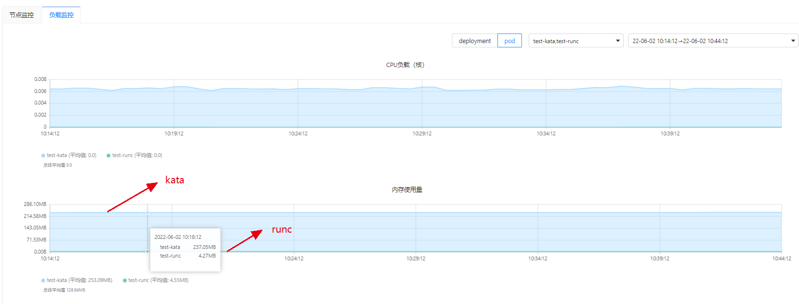
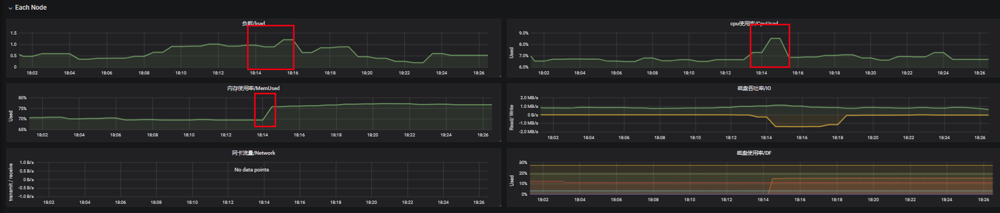
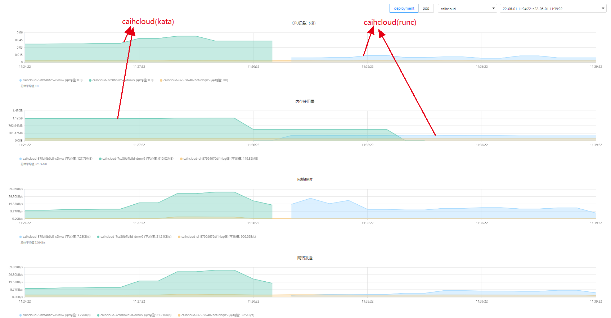

# 结论
- debug开启存在开销，初始65M左右
- 一个起了iperf服务的pod，runc与kata对比： 4M vs 237M
- caihcloud后端的pod，runc与切换成kata的资源消耗对比：132.6M vs 672.0M
- fio测试如果不设置sandbox_cgroup_only可能会把节点跑挂


# iperf pod（无负载）
```bash
    resources:
      limits:
        memory: "1Gi"
        cpu: "1"


[root@localhost hff]# kubectl top pod
NAME                              CPU(cores)   MEMORY(bytes)
test-kata                         0m           0Mi
test-runc                         0m           2Mi

# runc
[root@localhost ~]# systemd-cgtop | grep podcb448151-a612-4392-b96f-2b1fe0727dff
/kubepods/podcb448151-a612-4392-b96f-2b1fe0727dff                                                                             -      -     2.8M        -        -
/kubepods/podcb448151-a612-4392-b96f-2b1fe0727dff/592ed9bf30f1ca697569c6a40b87ff15ecb62e654146dc698c0dd63f51a51fe9            1      -    40.0K        -        -
/kubepods/podcb448151-a612-4392-b96f-2b1fe0727dff/b3fd8b1b3ad4a4a4c8767759c10f4e7f9dce018c55bdcf668aa32f2f5f11ca82            3      -     2.8M        -        -

# kata
[root@localhost ~]# systemd-cgtop | grep kata
/kata_overhead                                                                                                                -      -     2.4M        -        -
/kubepods/podfa152857-05d1-44fc-9cdc-d448b2c98941/kata_f40286f09e1ef5de468d894f1519c7ca6d30962653e7dce8daf90681802a0dde       7      -   165.3M        -        -
/system.slice/kata-monitor.service                                                                                            1      -    23.0M        -        -


[root@localhost ~]# systemd-cgtop | grep podfa152857-05d1-44fc-9cdc-d448b2c98941
/kubepods/podfa152857-05d1-44fc-9cdc-d448b2c98941                                                                             -      -   165.3M        -        -
/kubepods/podfa152857-05d1-44fc-9cdc-d448b2c98941/kata_f40286f09e1ef5de468d894f1519c7ca6d30962653e7dce8daf90681802a0dde       7      -   165.3M        -        -


```




# caihcloud pod
- caihcloud pod从runc切换成kata
- no pod overhead
- caihcloud未设置资源限制（默认限制1C2G）

## runc:
```bash
[root@localhost hff]# crictl ps | grep caihcloud
a3f70e49d6c15       519f90935898f       2 weeks ago         Running             caihcloud                              2                   bd033951719d1
[root@localhost hff]# crictl inspect a3f70e49d6c15 | grep "cgroupsPath"
        "cgroupsPath": "/kubepods/burstable/podba3213c0-2204-4641-a3e8-b2bd2a178684/a3f70e49d6c150de7628b21c325b2bc19a3a15a0ac57b1dde6c719bea8cfa9fc",
[root@localhost hff]# systemd-cgtop | grep podba3213c0-2204-4641-a3e8-b2bd2a178684
/kubepods/burstable/podba3213c0-2204-4641-a3e8-b2bd2a178684                    -      -   132.6M        -        -
[root@localhost hff]# systemd-cgtop | grep kata
/kata_overhead                                                                 -      -     4.9M        -        -
/system.slice/kata-monitor.service                                             1      -    23.2M        -        -
[root@localhost hff]# kubectl top pod -n caihcloud caihcloud-d8469d8f5-hs8ks
NAME                        CPU(cores)   MEMORY(bytes)
caihcloud-d8469d8f5-hs8ks   5m           125Mi
```
## kata:
```bash
[root@localhost hff]# crictl ps | grep caihcloud
d3dcfa636247a       519f90935898f       35 seconds ago      Running             caihcloud                              2                   5828a75f23260
[root@localhost hff]# crictl inspect d3dcfa636247a | grep "cgroupsPath"
        "cgroupsPath": "/kubepods/burstable/poda58b906b-1d6b-49c3-9bd6-ad57d20cae2d/d3dcfa636247a08ccf4f691ca96d18368813340ba3b73c8905bd9de7750a19eb",
[root@localhost hff]# systemd-cgtop | grep poda58b906b-1d6b-49c3-9bd6-ad57d20cae2d
/kubepods/burstable/poda58b906b-1d6b-49c3-9bd6-ad57d20cae2d                    -      -   672.0M        -        -
[root@localhost hff]# systemd-cgtop | grep kata
/kata_overhead                                                                 -      -     4.9M        -        -
/system.slice/kata-monitor.service                                             1      -    21.8M        
[root@localhost hff]# kubectl top pod -n caihcloud caihcloud-f954b5dcd-t9qln
NAME                        CPU(cores)   MEMORY(bytes)
caihcloud-f954b5dcd-t9qln   7m           121Mi

```








# sandbox_cgroup_only测试
注意，fio大文件测试kata，在不开启sandbox_cgroup_only会导致宿主机（8cpu8Gmem）跑挂

配置：
sandbox_cgroup_only: true/false
kata podoverhead: cpu: 250m memory: 160Mi
pod resource: limit 1C1Gi
debug_console_enabled = true

## sandbox_cgroup_only=false
此时kata 开销单独在一个cgroup（kata_overhead）
## 创建测试pod前，记录当前数据
```bash
[root@localhost hff]# systemd-cgtop | grep kata
/kata_overhead                                                                 -      -    65.0M        -        -
# 这个开销应该是开启了debug_console_enabled的开销。如果不开启此时没有开销
## 启动kata monitor代理服务

[root@localhost ~]# kata-monitor
INFO[0000] announce  app=kata-monitor arch=amd64 git-commit=0ad6f05dee04dec2a653806dc7d84d2bebf50175 go-version=go1.17.3 listen-address="127.0.0.1:8090" log-level=info os=linux runtime-endpoint=/run/containerd/containerd.sock version=0.3.0
[root@localhost hff]# systemd-cgtop | grep kata
/kata_overhead                                                                 -      -    65.0M        -        -

## 起一个kata pod，设置limit 1C1Gi，空负载

test-kata                         1/1     Running   0          3d21h
# 查看两部分资源占用
[root@localhost hff]# systemd-cgtop | grep kata
/kata_overhead                                                                                                                -      -   175.8M        -        -
/kata_overhead/84e5718cae98b3d72a9a7267525eab84d4ea4dc0aca7367bf14dc122241cbba5                                               7      -   110.7M        -        -
## 此时空复杂开销已达110.7M  
/kubepods/pod031c021e-c722-4191-ae7b-2bd73a1aae14/kata_84e5718cae98b3d72a9a7267525eab84d4ea4dc0aca7367bf14dc122241cbba5       1      -        -        -        -

[root@localhost hff]# kubectl top pod
NAME                              CPU(cores)   MEMORY(bytes)
test-kata                         0m           0Mi
[root@localhost hff]# kubectl describe node | grep test-kata
  default                     test-kata                                                1250m (16%)   1250m (16%)  1184Mi (18%)     1184Mi (18%)   7m32s

```


## sandbox_cgroup_only=true
此时kata 开销统计在pod cgroup中

```bash
[root@localhost ~]# systemd-cgtop | grep kata
/kata_overhead                                                                 -      -     1.1G        -        -
## 创建kata pod
[root@localhost ~]# systemd-cgtop | grep kata
/kata_overhead                                                                                                                -      -     1.1G        -        -
/kubepods/pod1cb49098-a5b6-4443-a28b-d007c314190d/kata_9990a39f85b71ad9faace730f72a999ec100b33d4a79ff1bb0f02450a1bf07e3       7      -   110.2M        -        -

[root@localhost ~]# kubectl top pod
NAME                              CPU(cores)   MEMORY(bytes)
test-kata                         0m           0Mi
[root@localhost ~]# kubectl describe node | grep test-kata
  default                     test-kata                                                1250m (16%)   1250m (16%)  1184Mi (18%)     1184Mi (18%)   95s

```


